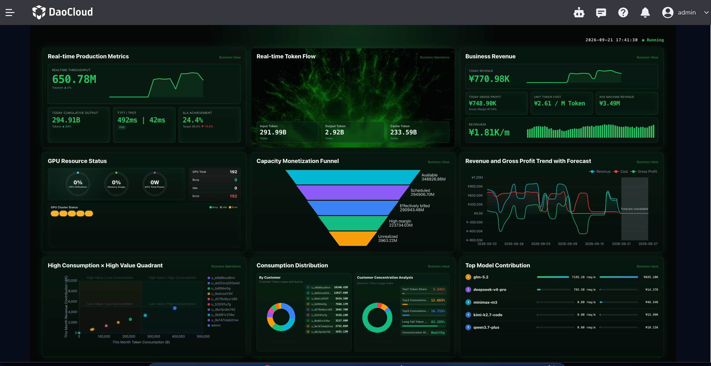

# Business Overview Panel

The Business Overview Panel is the default entry point of Cockpit. It presents the full picture of token production and business operations in a fixed **3x3 grid**.

The top-right corner of the header shows the local time and the "Running" status. Business data refreshes approximately once per minute by default.

## How to Open

1. Go to the Token Factory console.
2. In the product navigation, click **Cockpit**.
3. Select **Business Overview** (the default entry point).

## Page Description

| Area | Description |
| --- | --- |
| Header | Local time and "Running" status |
| 3x3 grid | Modules such as real-time production, traffic, business/organization, GPU, structure, and model contribution |
| Panel status | Shows "Loading" on the first load; shows "System exception" when a request fails, without displaying stale error details |

A failure in a single module does not block the other modules from rendering.

## 3x3 Grid Modules

=== "Operations mode"

    | Module | What to look at |
    | --- | --- |
    | **Real-time production metrics** | Real-time throughput, cumulative output today, and token latency (P90); the fourth card is the **SLA compliance rate** (the percentage-point gap from the target) |
    | **Real-time token flow** | Platform token traffic and its period-over-period change |
    | **Business revenue** | Revenue, cost, and gross profit today, plus the unit token cost (`/ M Token`) |
    | **GPU resource status** | GPU pool operating status and abnormal resources |
    | **Capacity monetization funnel** | The conversion process from capacity to billable tokens |
    | **Revenue and gross profit trends and forecast** | Historical revenue/gross profit trends and forecasts |
    | **High-consumption × high-value quadrant analysis** | Quadrant distribution of tenant token consumption and revenue contribution |
    | **Consumption distribution** | Usage distribution by customer, plus customer concentration risk grading |
    | **Top model contribution** | Contribution ranking by model |

=== "Enterprise mode"

    | Module | What to look at |
    | --- | --- |
    | **Real-time production metrics** | Real-time throughput, cumulative output today, and token latency (P90); the fourth card is the **real-time request count** (req/m) |
    | **Real-time token flow** | Platform token traffic and its period-over-period change |
    | **Business overview for the current period** | Monthly active user coverage, request volume comparison, cost allocation, and the 7-day user trend |
    | **GPU resource status** | GPU pool operating status and abnormal resources |
    | **Department quotas and consumption** | Organization monthly quota, consumption this month, and remaining quota; a limited quota utilization rate ≥ 80% is counted as a warning |
    | **Usage and capacity trends** | Input/output tokens and GPU utilization over the last 30 days, with a 7-day forecast dashed line |
    | **High-consumption × high-value quadrant analysis** | Quadrant distribution of department token consumption and active users |
    | **Organization usage distribution** | Usage distribution by department, plus department concentration risk grading |
    | **Top model contribution** | Contribution ranking by model |

## Reading Suggestions

- **Business review in operations mode**: combine business revenue, the capacity monetization funnel, revenue and gross profit trends, and customer concentration to assess revenue quality and customer structure risk.
- **Organizational governance in enterprise mode**: combine the business overview for the current period, department quotas, and organization usage distribution to identify departments over quota and low-efficiency quadrants.

## FAQ

**Why do some modules show no data?**

Cockpit is a read-side aggregated view that depends on upstream data such as usage, bills, and GPU metrics. If no data is available for the corresponding cluster or billing period, a module displays "No data" or stays in a failed-loading state. You can first check whether model services are generating invocations, and whether the billing and observability pipelines are working properly.

## Related Documents

- [What Is Cockpit](../intro/index.md)
- [Billing Center](../../leopard/index.md)
