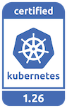
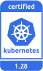

---
hide:
  - toc
---

# K8s Certified Service Provider

DaoCloud is a CNCF-certified Kubernetes service provider, officially known as a Kubernetes Certified Service Provider (KCSP). As early as 2017, DaoCloud successfully obtained official certification from Kubernetes, making it the first provider in China to gain recognition from CNCF.

We actively participate in CNCF-related community contributions throughout the year, leading technological trends in the community. Whenever a new version of Kubernetes is released, we are among the first to adapt to and enhance new features, pushing them to actual production environments.

As an officially certified KCSP, DaoCloud has extensive experience in helping enterprises deploy large-scale clusters using Kubernetes successfully.

Being a certified KCSP means that:

- DaoCloud is a recommended senior partner of Kubernetes officially.
- DaoCloud is recognized by the CNCF community as an excellent company with expert qualifications and fully competent for the professional work of Kubernetes cluster deployment.
- When end-users choose Kubernetes to deploy clusters, DaoCloud is a brand supplier recognized and recommended by the CNCF cloud native community.
- After being ranked in the KCSP for many years, DaoCloud has mastered the leading technology in the field of cloud native and always leads the development direction of the cloud native community.

Currently, authorized and compliant Kubernetes versions of DaoCloud include but are not limited to:

The currently maintained versions by K8s community:

Historical versions that are no longer maintained by the Kubernetes community, but are being continuously maintained by DaoCloud [KLTS](https://klts.io/):

<!--
Source: https://github.com/cncf/artwork/tree/master/projects/kubernetes/certified-kubernetes
-->

For more information about DaoCloud's open source contributions, please refer to the blog [DaoCloud is a K8s senior certification service provider](../blogs/221116-kcsp.md).

[Download DCE 5.0](../download/index.md){ .md-button .md-button--primary }
[Install DCE 5.0](../install/index.md){ .md-button .md-button--primary }
[Free Trial](license0.md){ .md-button .md-button--primary }
