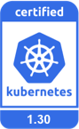
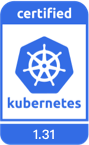
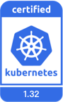

# K8s Certified Service Provider

The CNCF provides compliance certification for Kubernetes platform vendors around the world to validate product capabilities and delivery quality.

DaoCloud is a [CNCF-certified Kubernetes Certified Service Provider (KCSP)](https://landscape.cncf.io/?group=certified-partners-and-providers&item=platform--certified-kubernetes-distribution--daocloud-enterprise).
As early as 2017, DaoCloud passed the official certification, becoming one of the earliest CNCF-recognized Kubernetes service providers in China.  
We have remained deeply involved in the community for years — contributing code, docs and practices — and always stay aligned with the community’s upstream. With every new Kubernetes release, we are among the first to adapt and enhance new features, and deliver them into production environments.

## Kubernetes AI Conformance

To support the explosive growth of AI/ML workloads — and their needs for compute and hardware acceleration — CNCF launched the [Kubernetes AI Conformance](https://github.com/cncf/ai-conformance) standard.  
On top of the base [Kubernetes Conformance](https://github.com/cncf/k8s-conformance) requirements, it defines AI-specific functions, APIs and configuration rules, establishing a unified baseline for **consistent portability** and **efficient scheduling** of AI workloads across environments.

Certified platforms are authorized by CNCF to use the “AI Conformance” badge — meaning the distribution is recognized as AI-friendly and ready for AI/ML production use.

<figure markdown="span">
  { width="200" }
</figure>

As a leader in cloud-native open source in China, DaoCloud keeps pace with the community:  
after the AI Conformance standard was released, we were among the first to start AI Conformance testing for the mainstream Kubernetes v1.33 on our [DCE 5.0](https://docs.daocloud.io/) platform, and in October 2025 we [successfully passed the certification](https://github.com/cncf/ai-conformance/pull/13) —  
**becoming the first enterprise-grade AI/ML platform in China to achieve certification for this version.**

## Kubernetes Conformance

As an officially certified KCSP, DaoCloud has extensive experience in helping enterprises deploy large-scale clusters using Kubernetes successfully.

Being a certified KCSP means that:

- DaoCloud is a recommended senior partner of Kubernetes officially.
- DaoCloud is recognized by the CNCF community as an excellent company with expert qualifications and fully competent
  for the professional work of Kubernetes cluster deployment.
- When end-users choose Kubernetes to deploy clusters, DaoCloud is a brand supplier recognized and recommended by the CNCF cloud native community.
- After being ranked in the KCSP for many years, DaoCloud has mastered the leading technology in the field of cloud native
  and always leads the development direction of the cloud native community.

Currently, authorized and compliant Kubernetes versions of DaoCloud include but are not limited to:

The currently maintained versions by K8s community:

Historical versions that are no longer maintained by the Kubernetes community, but are being continuously maintained by DaoCloud [KLTS](https://klts.io/):

<!--
Source: https://github.com/cncf/artwork/tree/master/projects/kubernetes/certified-kubernetes
-->

For more information about DaoCloud's open source contributions, refer to the blog
[DaoCloud is a K8s senior certification service provider](../blogs/2022/221116-kcsp.md).

[Download DCE 5.0](../download/index.md){ .md-button .md-button--primary }
[Install DCE 5.0](../install/index.md){ .md-button .md-button--primary }
[Free Trial](license0.md){ .md-button .md-button--primary }
