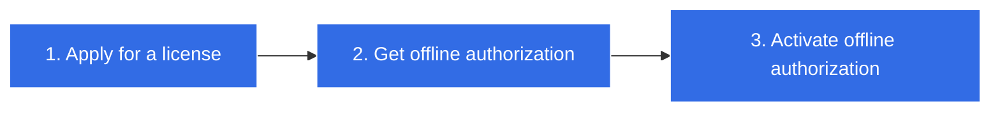
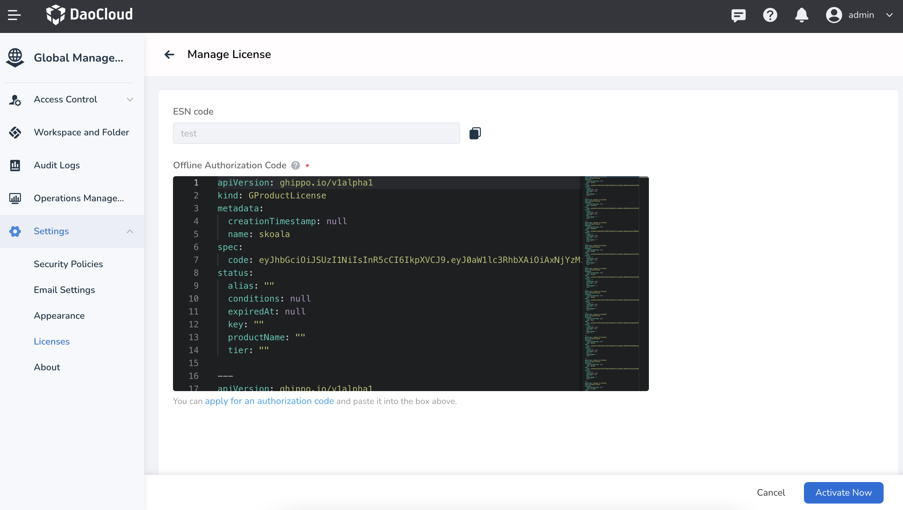
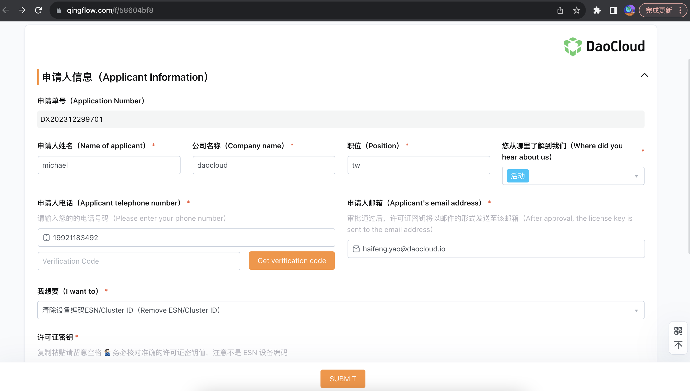

---
hide:
  - toc
---

# Free Trial

The modules included in DCE Community are [Global Management](../ghippo/intro/index.md),
[Container Management](../kpanda/intro/index.md), [Workbench](../amamba/intro/index.md),
[Insight](../insight/intro/index.md), and more.

## Apply for a License

Follow the steps below to get a license for your DCE Community:

1. Click [Apply for license](https://qingflow.com/f/58604bf8){ .md-button } and click __Submit__ after you fill in required information in the form.

    

2. Follow the on-screen instructions, check your email containing the license, and then click [Get an offline authorization code](https://license.daocloud.io/dce5-license){ .md-button }.

    

3. Input the license you just received and input your ESN, click __Get an offline authorization code__ .

    ESN is the unique device code of the cluster system.
    Follow the steps to get your ESN: Open DCE, click __Global Management__ -> __Settings__ -> __Licenses__ , click __Manage License__ , and copy the ESN code.

    

4. Paste the offline authorization code, and click __Activate Now__ . Congratulations! :smile: It's time to explore the new DCE 5.0 now!

!!! info "📢 Tips"

    The offline authorization code is bound to the device ESN. Please keep the license key email safe and secure.
    You can contact the DaoCloud delivery team at any time to reapply, as we have saved all your license keys for you.

## Renew License

If your license expires for any reason, you can follow the steps below to renew it.

### Recommended Approach

1. First, [clear the device code](https://qingflow.com/f/58604bf8). In the form, select __Remove ESN/Cluster ID__ and enter the [previous license key](https://license.daocloud.io/dce5-licenses). Once completed, click __SUBMIT__ .

    

2. Refer to the previous section to reapply for the license.

### Renew License by Modules

This method requires renewing the license for each installed module.
For example, DCE Community includes three modules: Container Management, Global Management, and Observability, each with its own license.
To do this, go to the [license page](https://qingflow.com/f/58604bf8) and select __Renew License__ for each module.

## Reference Links

The pages you may frequently access in the process of above procedure are listed as follows:

[Apply for a license](https://qingflow.com/f/58604bf8){ .md-button .md-button--primary }
[View your license](https://license.daocloud.io/dce5-licenses){ .md-button .md-button--primary }
[Get an offline authorization code](https://license.daocloud.io/dce5-license){ .md-button .md-button--primary }
[Install DCE 5.0](../install/index.md){ .md-button .md-button--primary }
