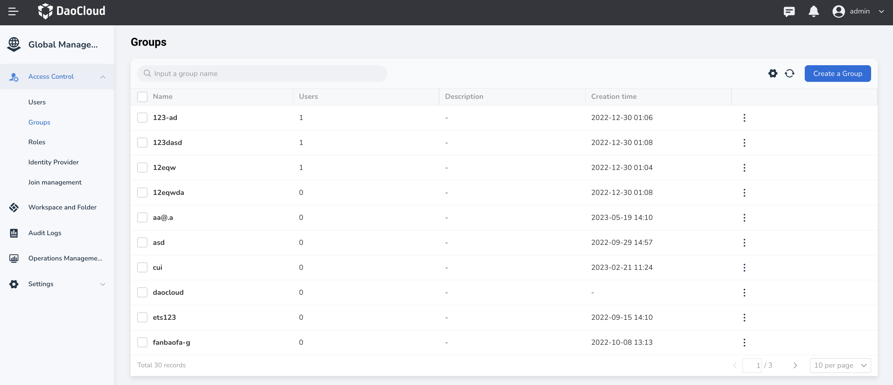
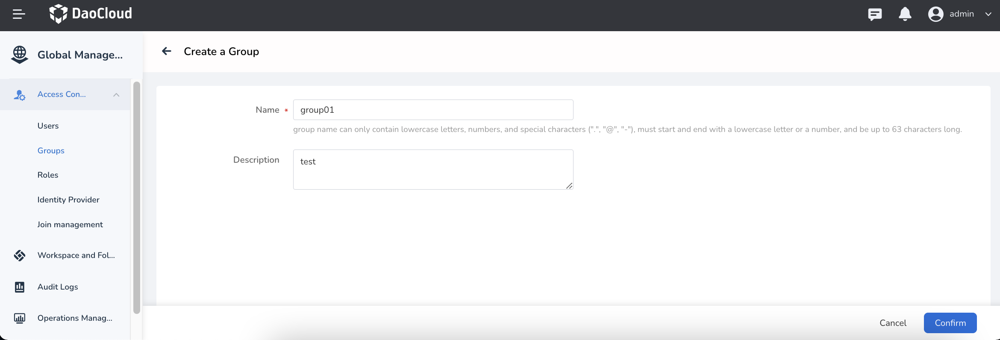
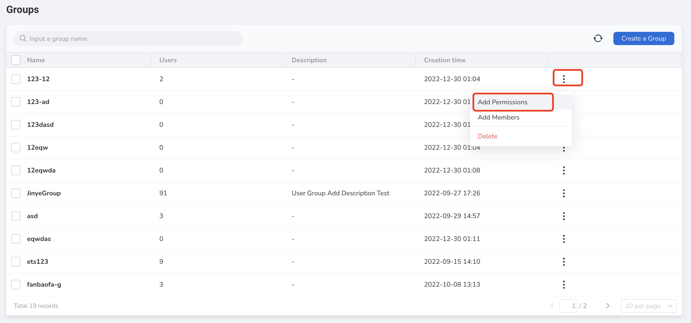
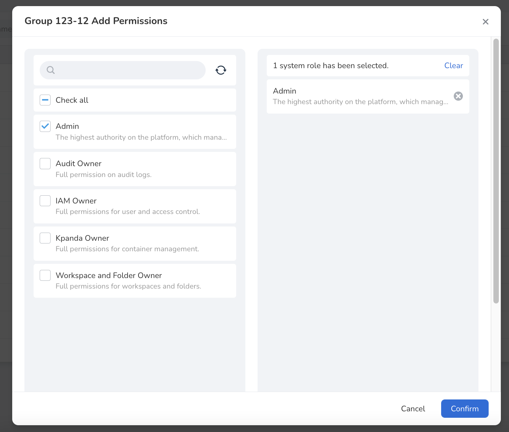
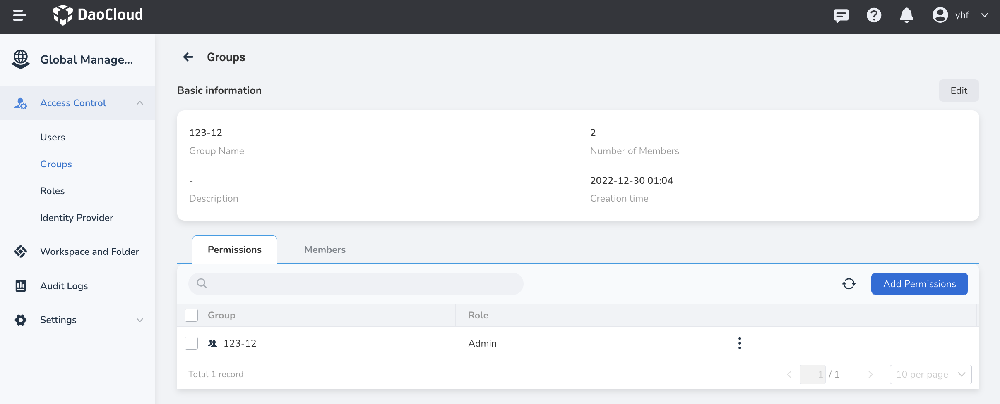
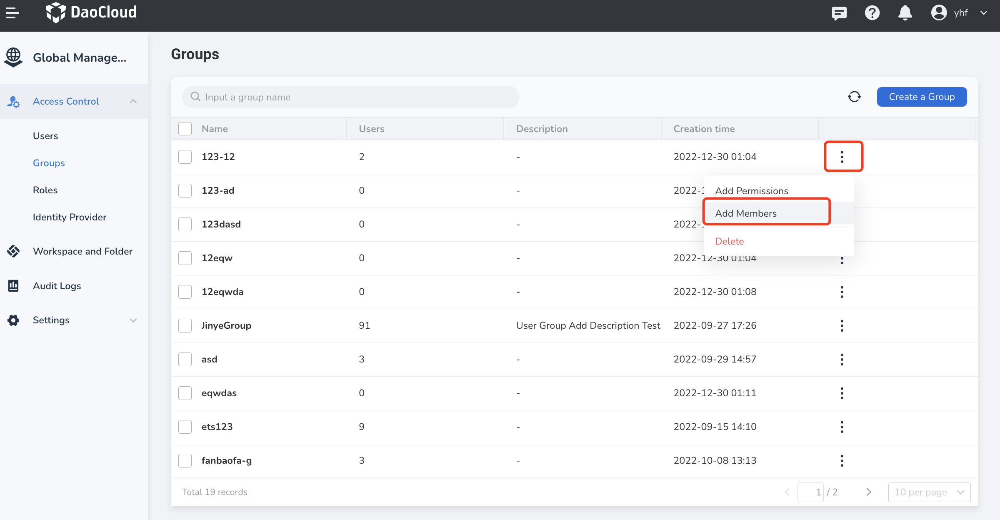
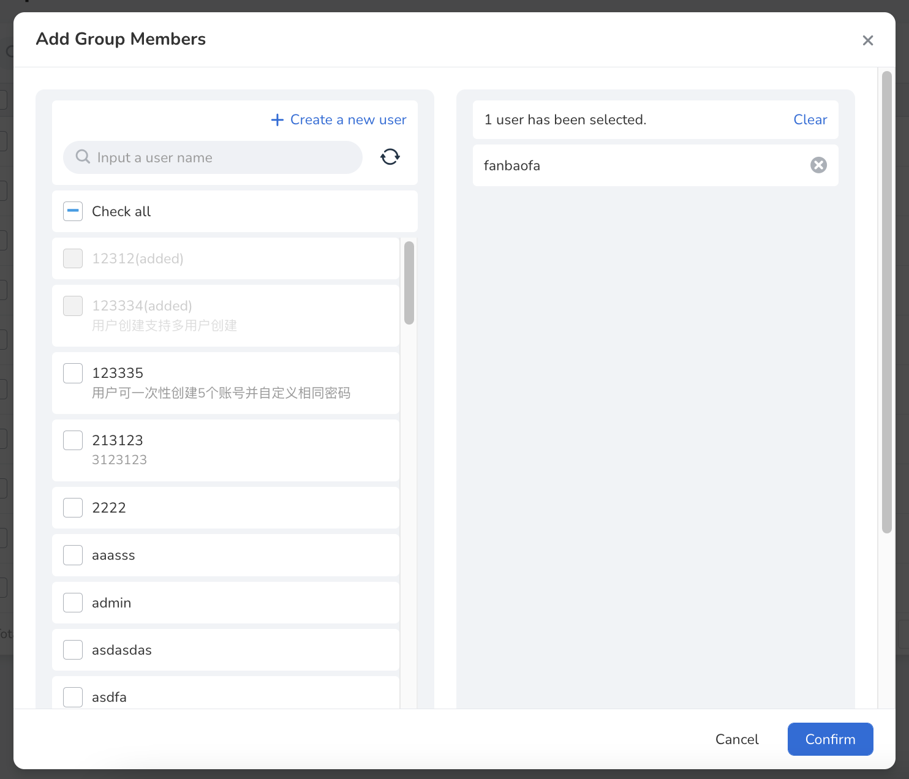
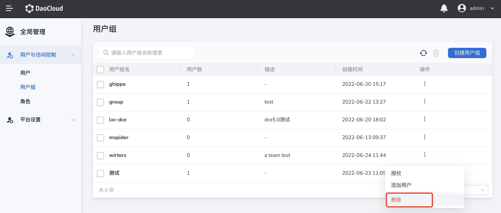
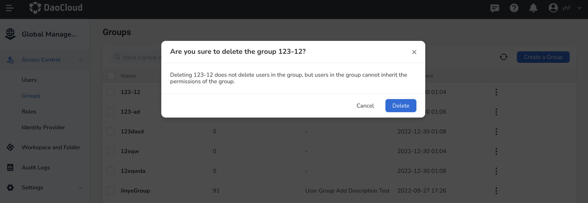
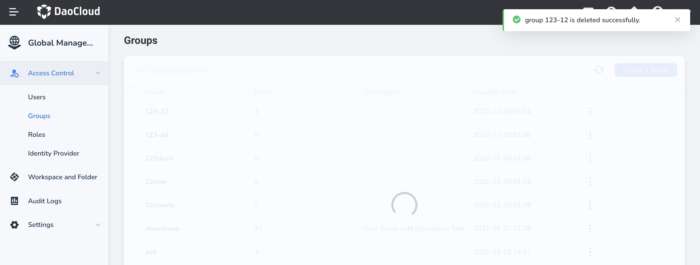

# user group

A user group is a collection of users. By joining a user group, a user can inherit the role permissions of the user group. Authorize users in batches through user groups to better manage users and their permissions.

## Applicable scene

When a user's permission changes, it only needs to be moved to the corresponding user group without affecting other users.

When the permissions of a user group change, you only need to modify the role permissions of the user group to apply to all users in the group.

## Create user group

Prerequisite: Have platform administrator Super Admin permission or user and access control administrator IAM Admin permission.

1. The administrator enters `User and Access Control`, selects `User Group`, enters the list of user groups, and clicks `Create User Group` on the upper right.

    

2. Fill in the user group information on the `Create User Group` page.

    

3. Click `OK`, the user group is created successfully, and you will return to the user group list page. The first line in the list is the newly created user group.

## Authorize user groups

Prerequisite: The user group already exists.

1. The administrator enters `User and Access Control`, selects `User Group`, enters the list of user groups, and clicks `...` -> `Authorization`.

    

2. On the `Authorization` page, check the required role permissions (multiple choices are allowed).

    

3. Click `OK` to complete the authorization for the user group. Automatically return to the user group list, click a user group to view the permissions granted to the user group.

    

## Add users to the user group

1. The administrator enters `User and Access Control`, selects `User Group` to enter the user group list, and on the right side of a user group, click `...` -> `Add User`.

    

2. On the `Add User` page, click the user to be added (multiple choices are allowed). If there is no user available, click `Go to create a new user`, first go to create a user, and then return to this page and click the `Refresh` button to display the newly created user.

    

3. Click `OK` to finish adding users to the user group.

!!! note

    Users in the user group will inherit the permissions of the user group; users who join the group can be viewed in the user group details.

## Delete user group

Note: Deleting a user group will not delete the users in the group, but the users in the group will no longer be able to inherit the permissions of the group

1. The administrator enters `User and Access Control`, selects `User Group` to enter the user group list, and on the right side of a user group, click `...` -> `Delete`.

    

2. Click `Remove` to delete the user group.

    

3. Return to the user group list, and the screen will prompt that the deletion is successful.

    

!!! note

    Note: Deleting a user group will not delete the users in the group, but the users in the group will no longer be able to inherit the permissions of the group.