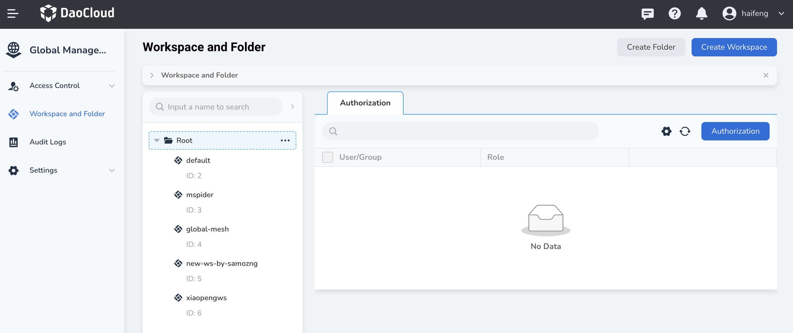
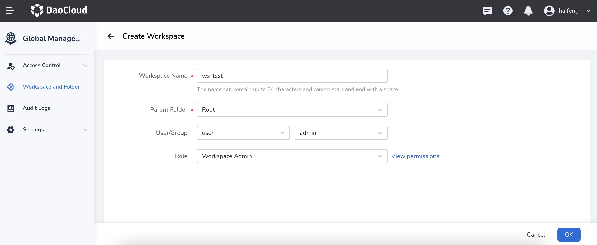

---
hide:
  - toc
---

# Create/delete workspace

A workspace is a resource category that represents a resource hierarchy.
A workspace can contain resources such as clusters, namespaces, and registries.
Usually a workspace corresponds to a project, and different resources can be assigned to each workspace, and different users and user groups can be assigned.

Follow the steps below to create a workspace.

1. Log in to the web console as a user with the admin/folder admin role, and click `Global Management` at the bottom of the left navigation bar.

    

3. Click `Workspace and Hierarchy` in the left navigation bar, and click the `Create Workspace` button in the upper right corner.

    

4. After filling in the workspace name, folder and other information, click `OK` to complete the creation of the workspace.

    

!!! tip

    After the workspace is successfully created, the name of the workspace will be displayed in the tree structure on the left, and folders and workspaces will be represented by different icons.

    

!!! note

    Select a workspace or folder, and click `...` on the right to edit or delete it.

    - When resources exist in resource groups and shared resources under the workspace, the workspace cannot be deleted, and all resources need to be unbound before deletion.

    - When the microservice engine module has access registration center resources under the workspace, the workspace cannot be deleted, and all access registration centers need to be removed before deleting the workspace.