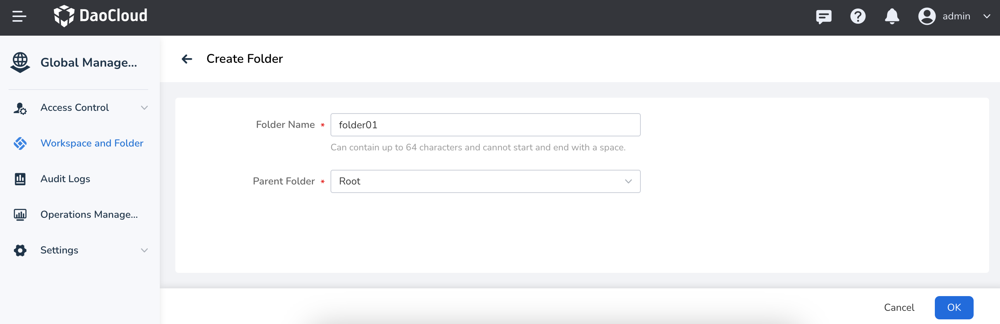
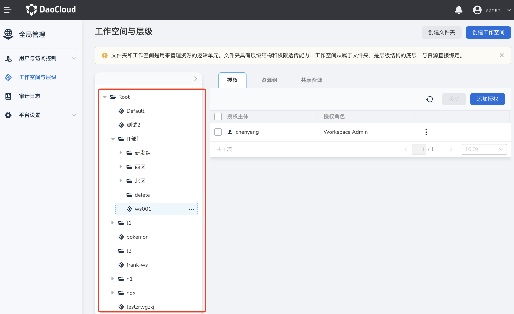

---
hide:
  - toc
---

# Create/delete folder

Folders have permission mapping capabilities, which can map the permissions of users/groups in this folder to subfolders, workspaces and resources under it.

Follow the steps below to create a folder.

1. Log in to the web console as a user with the admin/folder admin role, and click `Global Management` at the bottom of the left navigation bar.

    

1. Click `Workspace and Hierarchy` in the left navigation bar, and click the `Create Folder` button in the upper right corner.

    

1. After filling in the folder name, upper level folder and other information, click `OK` to complete creating the folder.

    

!!! tip

    After the folder is successfully created, the folder name will be displayed in the tree structure on the left, with different icons representing the workspace and folder.

    

!!! note

    Select a folder or folder, and click `...` on the right to edit or delete it.

    - When there are resources in the resource group and shared resources under this folder, the folder cannot be deleted, and all resources need to be unbound before deleting.

    - When the microservice engine module has access registry resources under this folder, this folder cannot be deleted, and all access registry centers need to be removed before deleting the folder.