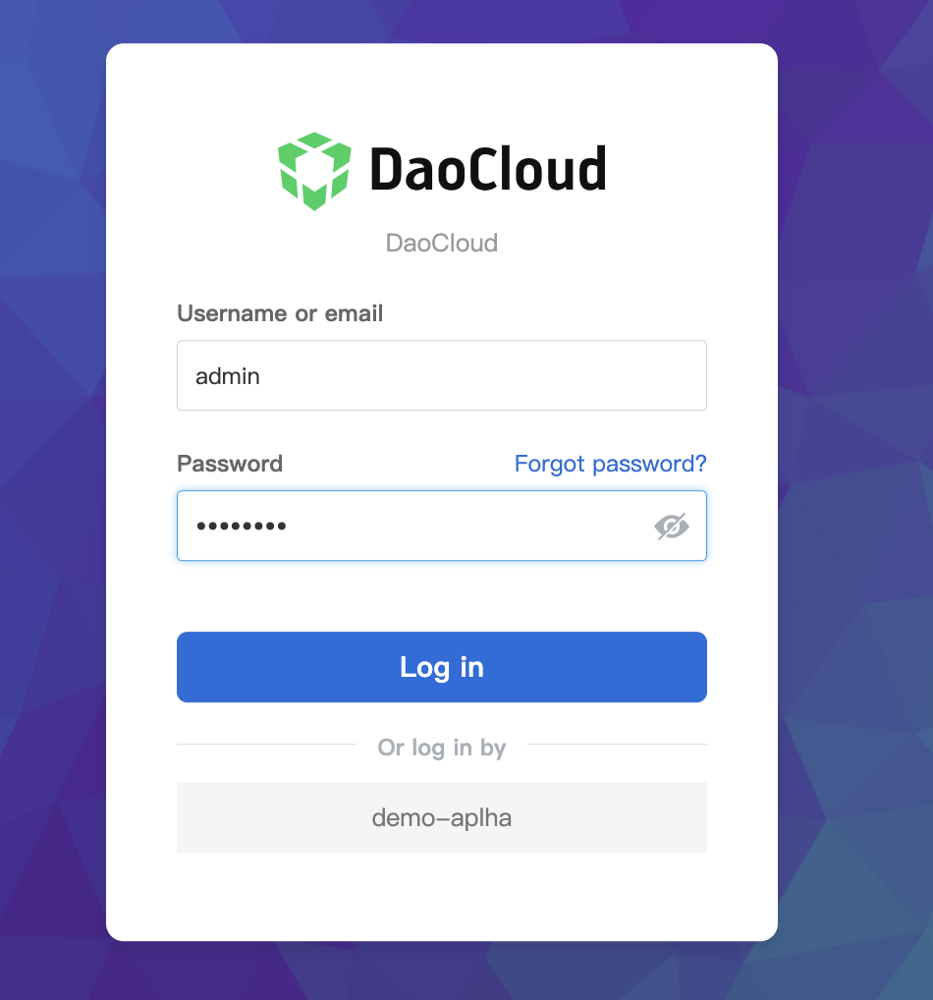

# Audit log

Audit logs help you monitor and record the activities of each user, and provide functions for collecting, storing and querying security-related records arranged in chronological order.
With the audit log service, you can continuously monitor and retain user behaviors in the global management module, including but not limited to user creation, user login/logout, user authorization, and user operations related to Kubernetes.

## Features

The audit log function has the following characteristics:

- Out of the box: When installing and using the platform, the audit log function will be enabled by default, automatically recording various user-related actions, such as creating users, authorization, login/logout, etc. By default, 365 days of user behavior can be viewed within the platform.

- Security analysis: The audit log will record user operations in detail and provide an export function. Through these events, you can judge whether the account is at risk.

- Real-time recording: Quickly collect operation events, and trace back in the audit log list after user operations, so that suspicious behavior can be found at any time.

- Convenient and reliable: The audit log supports manual cleaning and automatic cleaning, and the cleaning strategy can be configured according to your storage size.

## Download and export audit logs

1. Log in to the web console as a user with `Admin` or `Audit Owner` role.

    

2. Click `Global Management` at the bottom of the left navigation bar.

    

3. Navigate to Audit Logs under Global Management, select `Audit Logs`.

    

4. Under `Audit Log`, select the time range and click `Export` to download the audit log to the local.

5. Under `Audit Log`, click `Settings` and configure the following information to complete the configuration of the audit log cleanup policy.

    - Click the `Manual Cleanup` -> `Clear Now` button in the `Clear Global Management Audit Log` card, enter the number of days to clean up, and click the `Clean Up Now` button, the system will automatically clean up the audit logs before that number of days.
      It is recommended to export and save before cleaning.

    - Click the Auto-Clean-Set button in the `Clear Global Management Audit Log` card, enter the maximum storage time, and click `OK`, the system will automatically clear all logs outside this time. It is recommended to export and save before cleaning.

6. The Kubernetes-related log records in the audit log are provided by the observability module. In order to reduce the storage pressure of the audit log, the global management does not collect Kubernetes-related logs by default.
   If you need to record, please go to xxxxx to enable the service. The cleaning function after enabling is the same as that of the global management, but they do not affect each other.