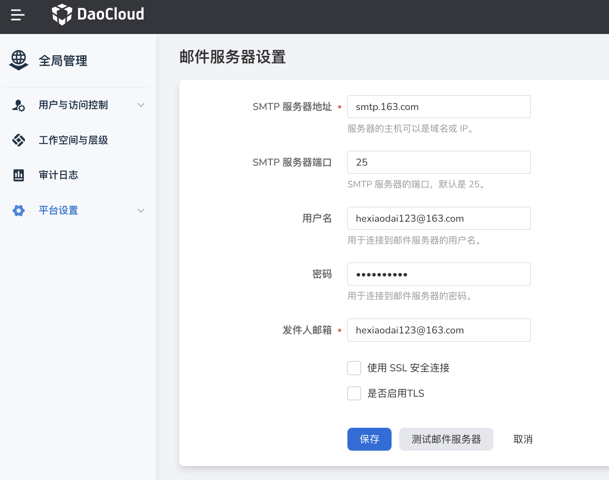

---
hide:
  - toc
---

# Mail Server

DCE 5.0 will send an e-mail to the user to verify the e-mail address if the user forgets the password to ensure that the user is acting in person.
In order for DCE 5.0 to be able to send email, you need to provide your mail server address first.

The specific operation steps are as follows:

1. Log in to the web console as a user with `admin` role. Click `Global Management` at the bottom of the left navigation bar.

    

1. Click `Platform Settings`, select `Mail Server Settings`.

    

    Complete the following fields to configure the mail server:

    | field | description | example value |
    | ----------------- | -------------------------------- ----------------------------- | ------------ |
    | SMTP server address | SMTP server address that can provide mail service | smtp.163.com |
    | SMTP server port | Port for sending mail | 25 |
    | Username | Name of the SMTP user | test@163.com |
    | Password | Password for the SMTP account | 123456 |
    | Sender's email address | Sender's email address | test@163.com |
    | Use SSL secure connection | SSL can be used to encrypt emails, thereby improving the security of information transmitted via emails, usually need to configure a certificate for the mail server | Disable |

1. After the configuration is complete, click `Save`, and click `Test Mail Server`.

    

1. A message indicating that the mail has been successfully sent appears in the upper right corner of the screen, indicating that the mail server has been successfully set up.

    

## common problem

Q: What is the reason why the user still cannot retrieve the password after the mail server is set up?

Answer: The user may not have an email address or set a wrong email address; at this time, users with the admin role can find the user by username in `Global Management` -> `Users and Access Control`, and set it as The user sets a new login password.

If the mail server is not connected, please check whether the mail server address, user name and password are correct.