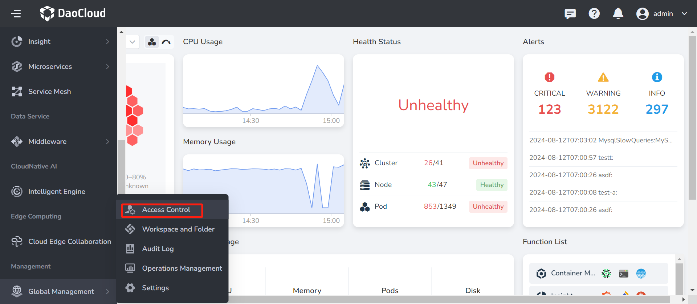

---
hide:
  - toc
---

# About the platform

`About the platform` mainly presents the current updated version of each sub-module of the platform, declares the various open source software used by the platform, and thanks the technical team of the platform in the form of an animation video.

View steps:

1. Log in to the web console as a user with `Admin` role. Click `Global Management` at the bottom of the left navigation bar.

    

2. Click `Platform Settings`, select `About Platform`, and check the product version, open source software statement and technical team.

    

    **product version**

    

    **License Statement**

    

    **Technical Team**

    