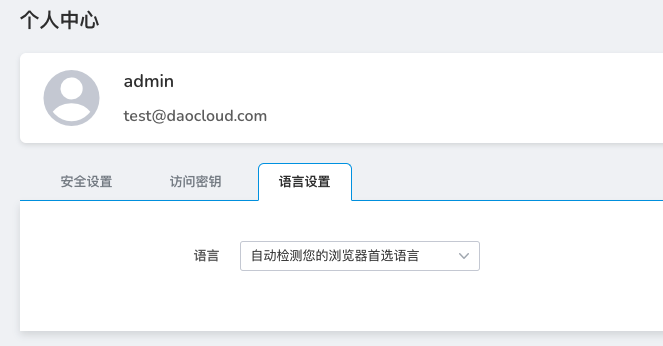

---
hide:
  - toc
---

# language settings

This section explains how to set the interface language. Currently supports Chinese, English two languages.

Language setting is the portal for the platform to provide multilingual services. The platform is displayed in Chinese by default. Users can switch the platform language by selecting English or automatically detecting the browser language preference according to their needs.
Each user's multilingual service is independent of each other, and switching will not affect other users.

The platform provides three ways to switch languages: Chinese, English-English, and automatically detect your browser language preference.

The operation steps are as follows.

1. Log in to the web console with your username/password. Click `Global Management` at the bottom of the left navigation bar.

    

2. Click the user name in the upper right corner and select `Personal Center`.

    

3. Click the `Language Settings` tab.

    

4. Toggle the language option.

    