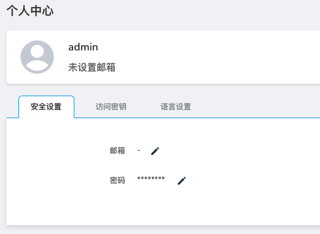

---
hide:
  - toc
---

# Security Settings

Function description: It is used to fill in the email address and modify the login password.

- Email: After the administrator configures the email server address, the user can click the Forget Password button on the login page to fill in the email address there to retrieve the password.
- Password: The password used to log in to the platform, it is recommended to change the password regularly.

The specific operation steps are as follows:

1. Log in to the web console with your username/password. Click `Global Management` at the bottom of the left navigation bar.

    

2. Click the user name in the upper right corner and select `Personal Center`.

    

3. Click the `Security Settings` tab. Fill in your email address or change the login password.

    