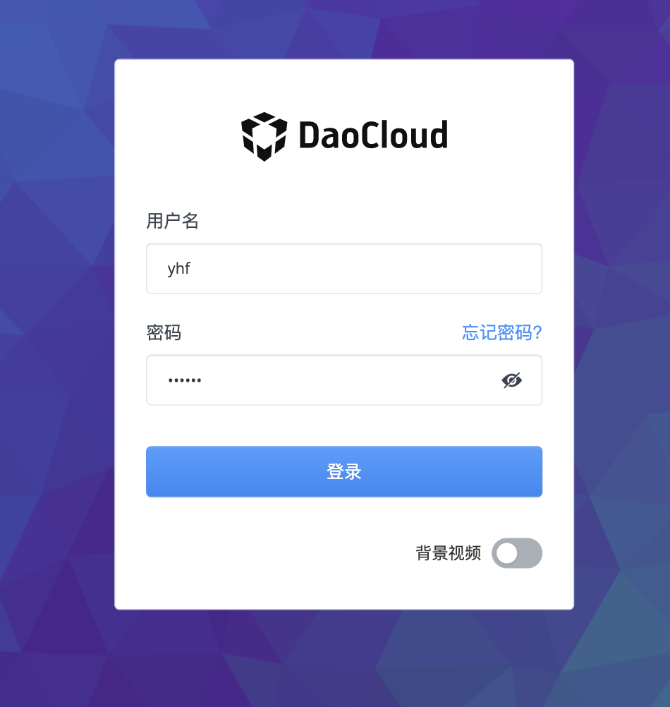

# Reset Password

If you forget your password, you can reset it by following the instructions on this page.

## Reset password steps

When an administrator initially creates a user, it sets a username and password for it.
After the user logs in, fill in the email address and change the password in `Personal Center`.
If the user has not set an email address, he can only contact the administrator to reset the password.

1. If the user forgets the password, he can click `forgot password` on the login interface.

    

1. Enter the username and click `Submit`.

    To prevent spam, after clicking 'Submit', the button will be grayed out and a 1 minute countdown will be displayed.
    If you haven't received the email after 1 minute, please click this button again.

    

1. Find the password reset email in the mailbox, and click the `Password Reset` button.

    

1. Follow the screen prompts to set a new password and click `OK`. The requirements for setting a new password are consistent with the password rules when creating a user.

    

1. The screen prompts that the password has been changed successfully.

    

## Reset password process

The schematic diagram of the entire password reset process is as follows.

