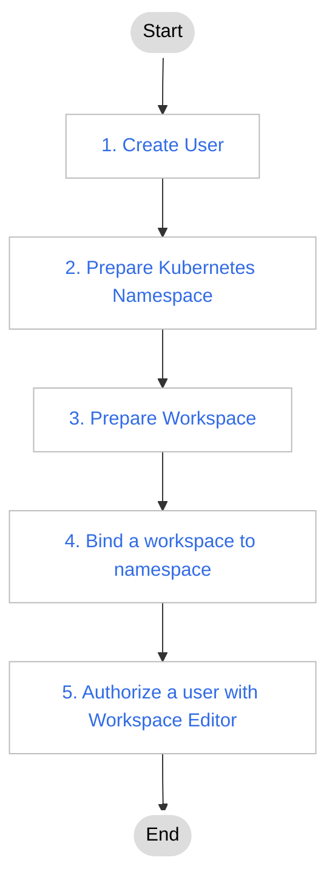

# Ordinary user authorization plan

Ordinary users refer to those who can use most of DCE's product modules and features (except management features), have certain operation rights to resources within the scope of authority, and can independently use resources to deploy applications.

The authorization and resource planning process for such users is shown in the following figure.

After authorization, the permissions of ordinary users in each module are:

- [Workbench](../permissions/amamba.md)
- [Microservice Engine](../permissions/skoala.md)
- [Service Mesh](../permissions/mspider.md) (need to repeat 2 - 4 to prepare mesh/mesh namespace and bind to workspace)
- [Observability](../../insight/intro/permission.md)
