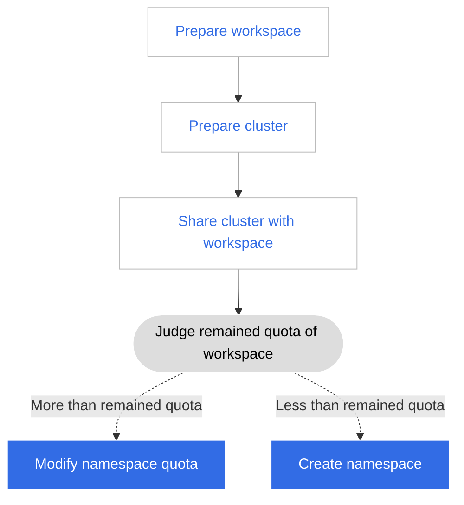

# Assign the cluster to multiple workspaces (tenants)

Cluster resources are usually managed by operation and maintenance personnel. When assigning resource allocations, they need to create namespaces to isolate resources, and set resource quotas.
This method has a disadvantage. If the business volume of the enterprise is large, manual allocation of resources requires a large workload, and it is not a small difficulty to flexibly allocate resource quotas.

DCE introduces the concept of workspace for this purpose. Workspaces can provide higher-dimensional resource quota capabilities through shared resources, enabling workspaces (tenants) to self-create Kubernetes namespaces under resource quotas.

For example, if you want to have several departments share different clusters.

| | Cluster01 (common) | Cluster02 (high availability) |
| ----------------- | ----------------- | ------------- ------ |
| Department (workspace) A | 50 quota | 10 quota |
| Department (workspace) B | 100 quota | 20 quota |

You can share the cluster with multiple departments/workspace/tenants by following the process:

## Prepare a workspace

In order to meet the multi-tenant  use cases, the workspace forms an isolated resource environment based on multiple resources such as clusters, cluster namespaces, meshs, mesh namespaces, multicloud, and multicloud namespaces.
Workspaces can be mapped to various concepts such as projects, tenants, enterprises, and suppliers.

1. Log in to DCE 5.0 as a user with the admin/folder admin role, and click __Global Management__ at the bottom of the left navigation bar.

    

1. Click __Workspace and Folder__ in the left navigation bar, and click the __Create Workspace__ button in the upper right corner.

    

1. After filling in the workspace name, folder and other information, click __OK__ to complete the creation of the workspace.

    

## Prepare a cluster

The workspace is to meet the multi-tenant  use cases. It forms an isolated resource environment based on multiple resources such as clusters, cluster namespaces, meshs, mesh namespaces, multiclouds, and multicloud namespaces. Workspaces can be mapped to projects and tenants., business, supplier and many other concepts.

Follow the steps below to prepare a cluster.

1. Click __Container Management__ at the bottom of the left navigation bar, and select __Cluster List__ .

    

1. Click __Create Cluster__ [Create a Cluster](../../kpanda/user-guide/clusters/create-cluster.md), or click __Join Cluster__ [Join a Cluster](../../kpanda/user-guide/clusters/integrate-cluster.md).

## Add a cluster to the workspace

Return to __Global Management__ to add clusters for the workspace.

1. Click __Global Management__ -> __Workspace and Folder__ -> __Shared Resources__ , click a workspace name, and click the __New Shared Resource__ button.

    

1. Select a cluster, fill in the resource limit, and click __OK__ .

    

Next step: After allocating cluster resources to multiple workspaces, users can go to __Workbench__ under these workspaces [create namespace and deploy application](../../amamba/user-guide/namespace/namespace.md).
