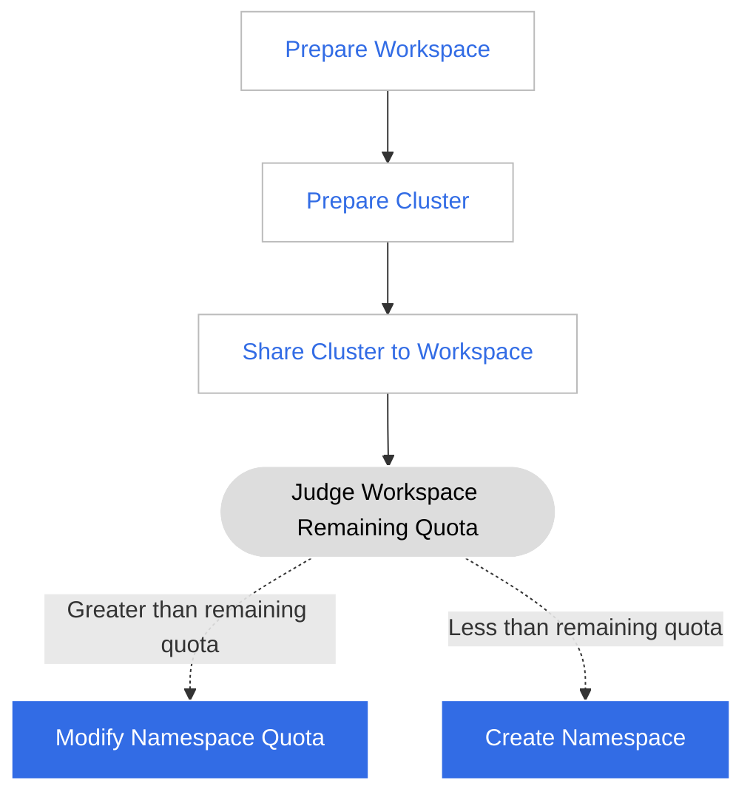
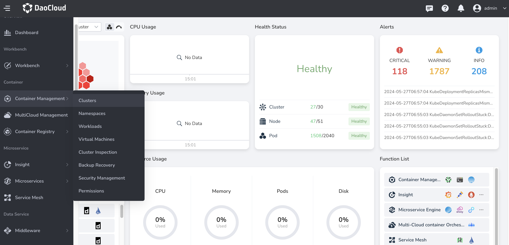
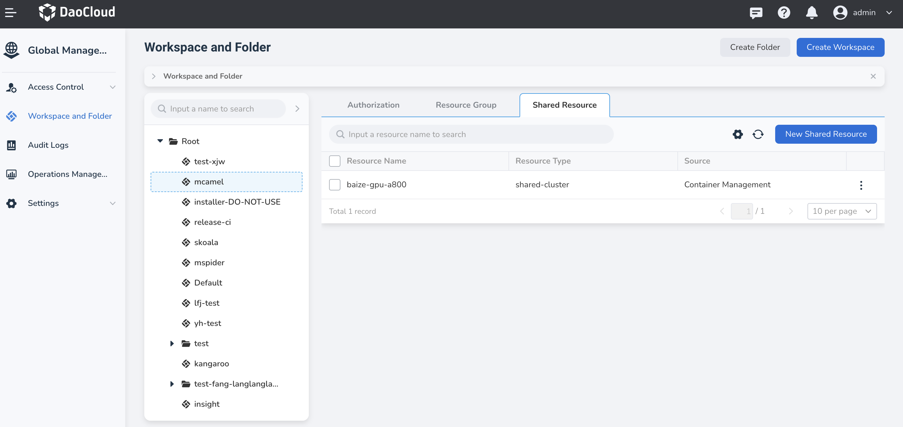
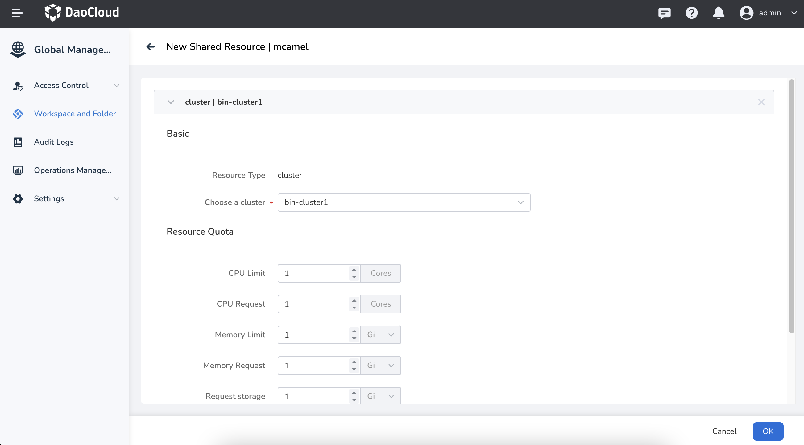

# Assign a Cluster to Multiple Workspaces (Tenants)

Cluster resources are typically managed by operations personnel. When allocating resources,
they need to create namespaces to isolate resources and set resource quotas.
This method has a drawback: if the business volume of the enterprise is large,
manually allocating resources requires a significant amount of work,
and flexibly adjusting resource quotas can also be challenging.

To address this, DCE introduces the concept of workspaces. By sharing resources,
workspaces can provide higher-dimensional resource quota capabilities,
allowing workspaces (tenants) to self-create Kubernetes namespaces under resource quotas.

For example, if you want several departments to share different clusters:

|                   | Cluster01 (Normal) | Cluster02 (High Availability) |
| ----------------- | ------------------ | ----------------------------- |
| Department (Workspace) A | 50 quota          | 10 quota                |
| Department (Workspace) B | 100 quota         | 20 quota                |

You can follow the process below to share clusters with multiple departments/workspaces/tenants:

## Prepare a Workspace

Workspaces are designed to meet multi-tenant usage scenarios, forming isolated resource environments based on clusters,
cluster namespaces, meshes, mesh namespaces, multi-cloud, multi-cloud namespaces, and other resources. Workspaces
can be mapped to various concepts such as projects, tenants, enterprises, and suppliers.

1. Log in to DCE 5.0 with a user having the admin/folder admin role and click __Global Management__ at the bottom of the left navigation bar.

    

2. Click __Workspaces and Folders__ in the left navigation bar, then click the __Create Workspace__ button at the top right.

    

3. Fill in the workspace name, folder, and other information, then click __OK__ to complete the creation of the workspace.

    

## Prepare a Cluster

Workspaces are designed to meet multi-tenant usage scenarios, forming isolated resource environments based on clusters, cluster namespaces, meshes, mesh namespaces, multi-cloud, multi-cloud namespaces, and other resources. Workspaces can be mapped to various concepts such as projects, tenants, enterprises, and suppliers.

Follow these steps to prepare a cluster.

1. Click __Container Management__ at the bottom of the left navigation bar, then select __Clusters__ .

    

1. Click __Create Cluster__ to [create a cluster](../../kpanda/user-guide/clusters/create-cluster.md) or click __Integrate Cluster__ to [integrate a cluster](../../kpanda/user-guide/clusters/integrate-cluster.md).

## Add Cluster to Workspace

Return to __Global Management__ to add clusters to the workspace.

1. Click __Global Management__ -> __Workspaces and Folders__ -> __Shared Resources__, then click a workspace name and click the __New Shared Resource__ button.

    

1. Select the cluster, fill in the resource quota, and click __OK__ .

    

Next Step: After allocating cluster resources to multiple workspaces, users can go to __Workbench__ to
[create namespaces and deploy applications](../../amamba/user-guide/namespace/namespace.md) in these workspaces.
