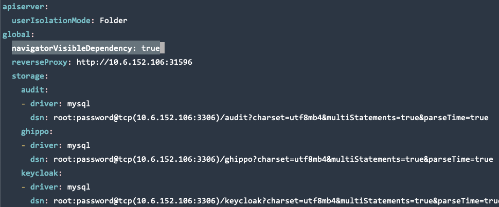
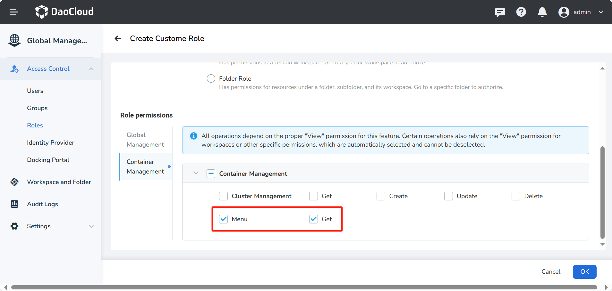
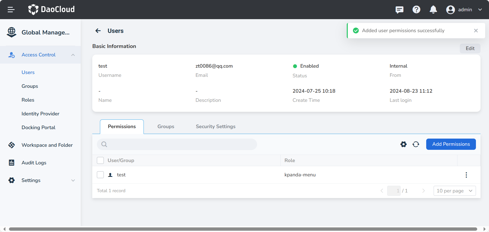
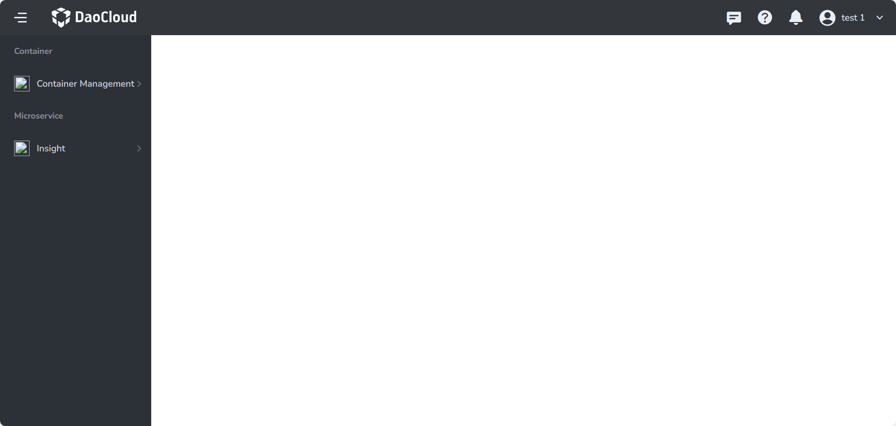

# Display/Hide Navigation Bar Menu Based on Permissions

Under the current permission system, Global Management has the capability to regulate the visibility
of navigation bar menus according to user permissions. However, due to the authorization information
of Container Management not being synchronized with Global Management, Global Management cannot
accurately determine whether to display the Container Management menu.

This document implements the following through configuration:
By default, the menus for Container Management and Insight will **not be displayed in areas where
Global Management cannot make a judgment**. A **Whitelist** authorization strategy is employed to
effectively manage the visibility of these menus. (The permissions for clusters or namespaces
authorized through the Container Management page cannot be perceived or judged by Global Management)

For example, if User A holds the Cluster Admin role for cluster A in Container Management, Global Management
cannot determine whether to display the Container Management menu. After the configuration described in this
document, User A will not see the Container Management menu by default. They will need to have **explicit
permission in Global Management** to access the Container Management menu.

## Prerequisites

The feature to show/hide menus based on permissions must be enabled. The methods to enable this are as follows:

* For new installation enviroments, add the `--set global.navigatorVisibleDependency=true` parameter when using `helm install`.
* For existing environments, back up values using `helm get values ghippo -n ghippo-system -o yaml`, then modify bak.yaml and add `global.navigatorVisibleDependency: true`.



Then upgrade the Global Management using the following command:

```shell
helm upgrade ghippo ghippo-release/ghippo \  
  -n ghippo-system \  
  -f ./bak.yaml \  
  --version ${version}
```

## Configure the Navigation Bar

Apply the following YAML in kpanda-global-cluster:

```yaml
apiVersion: ghippo.io/v1alpha1  
kind: GProductNavigator  
metadata:  
  name: kpanda-menus-custom  
spec:  
  category: container  
  gproduct: kpanda  
  iconUrl: ./ui/kpanda/kpanda.svg  
  isCustom: true  
  localizedName:  
    en-US: Container Management  
    zh-CN: 容器管理  
  menus:  
    - iconUrl: ''  
      isCustom: true  
      localizedName:  
        en-US: Clusters  
        zh-CN: 集群列表  
      name: Clusters  
      order: 80  
      url: ./kpanda/clusters  
      visible: true  
      visibleDependency:  
        permissions:  
          - kpanda.cluster.*  
          - kpanda.menu.get  
    - iconUrl: ''  
      isCustom: true  
      localizedName:  
        en-US: Namespaces  
        zh-CN: 命名空间  
      name: Namespaces  
      order: 70  
      url: ./kpanda/namespaces  
      visible: true  
      visibleDependency:  
        permissions:  
          - kpanda.cluster.*  
          - kpanda.menu.get  
    - iconUrl: ''  
      isCustom: true  
      localizedName:  
        en-US: Workloads  
        zh-CN: 工作负载  
      name: Workloads  
      order: 60  
      url: ./kpanda/workloads/deployments  
      visible: true  
      visibleDependency:  
        permissions:  
          - kpanda.cluster.*  
          - kpanda.menu.get  
    - iconUrl: ''  
      isCustom: true  
      localizedName:  
        en-US: Permissions  
        zh-CN: 权限管理  
      name: Permissions  
      order: 10  
      url: ./kpanda/rbac/content/cluster  
      visible: true  
      visibleDependency:  
        permissions:  
          - kpanda.cluster.*  
          - kpanda.menu.get  
  name: Container Management 
  order: 50  
  url: ./kpanda/clusters  
  visible: true  
  
---
apiVersion: ghippo.io/v1alpha1  
kind: GProductNavigator  
metadata:  
  name: insight-menus-custom  
spec:  
  category: microservice  
  gproduct: insight  
  iconUrl: ./ui/insight/logo.svg  
  isCustom: true  
  localizedName:  
    en-US: Insight  
    zh-CN: 可观测性  
  menus:  
    - iconUrl: ''  
      isCustom: true  
      localizedName:  
        en-US: Overview  
        zh-CN: 概览  
      name: Overview  
      order: 9  
      url: ./insight/overview  
      visible: true  
      visibleDependency:  
        permissions:  
          - kpanda.cluster.*  
          - kpanda.menu.get  
    - iconUrl: ''  
      isCustom: true  
      localizedName:  
        en-US: Dashboard  
        zh-CN: 仪表盘  
      name: Dashboard  
      order: 8  
      url: ./insight/dashboard  
      visible: true  
      visibleDependency:  
        permissions:  
          - kpanda.cluster.*  
          - kpanda.menu.get  
    - iconUrl: ''  
      isCustom: true  
      localizedName:  
        en-US: Infrastructure  
        zh-CN: 基础设施  
      name: Infrastructure  
      order: 7  
      url: ./insight/clusters  
      visible: true  
      visibleDependency:  
        permissions:  
          - kpanda.cluster.*  
          - kpanda.menu.get  
    - iconUrl: ''  
      isCustom: true  
      localizedName:  
        en-US: Metrics  
        zh-CN: 指标  
      name: Metrics  
      order: 6  
      url: ./insight/metric/basic  
      visible: true  
      visibleDependency:  
        permissions:  
          - kpanda.cluster.*  
          - kpanda.menu.get  
    - iconUrl: ''  
      isCustom: true  
      localizedName:  
        en-US: Logs  
        zh-CN: 日志  
      name: Logs  
      order: 5  
      url: ./insight/logs  
      visible: true  
      visibleDependency:  
        permissions:  
          - kpanda.cluster.*  
          - kpanda.menu.get  
    - iconUrl: ''  
      isCustom: true  
      localizedName:  
        en-US: Trace Tracking  
        zh-CN: 链路追踪  
      name: Trace Tracking  
      order: 4  
      url: ./insight/topology  
      visible: true  
      visibleDependency:  
        permissions:  
          - kpanda.cluster.*  
          - kpanda.menu.get  
    - iconUrl: ''  
      isCustom: true  
      localizedName:  
        en-US: Alerts  
        zh-CN: 告警  
      name: Alerts  
      order: 3  
      url: ./insight/alerts/active/metrics  
      visible: true  
      visibleDependency:  
        permissions:  
          - kpanda.cluster.*  
          - kpanda.menu.get  
    - iconUrl: ''  
      isCustom: true  
      localizedName:  
        en-US: Collect Management  
        zh-CN: 采集管理  
      name: Collect Management  
      order: 2  
      url: ./insight/agents  
      visible: true  
      visibleDependency:  
        permissions:  
          - kpanda.cluster.*  
          - kpanda.menu.get  
    - iconUrl: ''  
      isCustom: true  
      localizedName:  
        en-US: System Management  
        zh-CN: 系统管理  
      name: System Management  
      order: 1  
      url: ./insight/system-components  
      visible: true  
      visibleDependency:  
        permissions:  
          - kpanda.cluster.*  
          - kpanda.menu.get  
  name: Insight 
  order: 30  
  url: ./insight  
  visible: true  
  
---
apiVersion: ghippo.io/v1alpha1  
kind: GProductResourcePermissions  
metadata:  
  name: kpanda  
spec:  
  actions:  
    - localizedName:  
        en-US: Create  
        zh-CN: 创建  
      name: create  
    - localizedName:  
        en-US: Delete  
        zh-CN: 删除  
      name: delete  
    - localizedName:  
        en-US: Update  
        zh-CN: 编辑  
      name: update  
    - localizedName:  
        en-US: Get  
        zh-CN: 查看  
      name: get  
    - localizedName:  
        en-US: Admin  
        zh-CN: 管理  
      name: admin  
  authScopes:  
    - resourcePermissions:  
        - actions:  
            - name: get  
            - dependPermissions:  
                - action: get  
              name: create  
            - dependPermissions:  
                - action: get  
              name: update  
            - dependPermissions:  
                - action: get  
              name: delete  
          resourceType: cluster  
        - actions:  
            - name: get  
          resourceType: menu  
      scope: platform  
    - resourcePermissions:  
        - actions:  
            - name: admin  
              tips:  
                - en-US: >-  
                    If the workspace is bound to a cluster, it will be assigned  
                    the Cluster Admin role upon authorization.  
                  zh-CN: 若工作空间绑定了集群，授权后还将被映射为对应集群的 Cluster Admin 角色  
          resourceType: cluster  
        - actions:  
            - name: get  
              tips:  
                - en-US: >-  
                    If the workspace is bound to a namespace, it will be  
                    assigned the NS View role upon authorization.  
                  zh-CN: 若工作空间绑定了命名空间，授权后还将被映射为对应命名空间的 NS View 角色  
            - name: update  
              tips:  
                - en-US: >-  
                    If the workspace is bound to a namespace, it will be  
                    assigned the NS Edit role upon authorization.  
                  zh-CN: 若工作空间绑定了命名空间，授权后还将被映射为对应命名空间的 NS  Edit 角色  
            - name: admin  
              tips:  
                - en-US: >-  
                    If the workspace is bound to a namespace, it will be  
                    assigned the NS Admin role upon authorization.  
                  zh-CN: 若工作空间绑定了命名空间，授权后还将被映射为对应命名空间的 NS Admin 角色  
          resourceType: namespace  
      scope: workspace  
  gproduct: kpanda  
  resourceTypes:  
    - localizedName:  
        en-US: Cluster Management  
        zh-CN: 集群管理  
      name: cluster  
    - localizedName:  
        en-US: Menu  
        zh-CN: 菜单  
      name: menu  
    - localizedName:  
        en-US: Namespace Management  
        zh-CN: 命名空间  
      name: namespace
```

## Achieve the Above Effect Through Custom Roles

!!! note

    Only the menus for the Container Management module need to be configured separately menu permissions.
    Other modules will automatically show/hide based on user permissions

Create a custom role that includes the permission to view the Container Management menu, and then grant
this role to users who need access to the Container Management menu.





you can see the navigation bar menus for container management and observability. The result is as follows:


