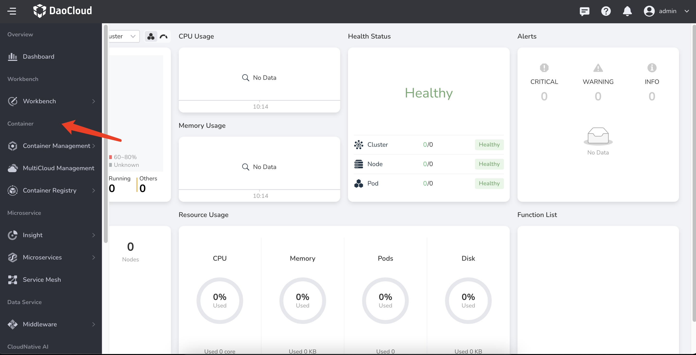
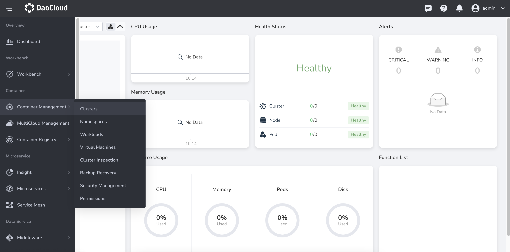

# Custom Navigation Bar

Currently, the custom navigation bar needs to be manually created as a YAML file and applied to the cluster.

## Navigation Bar Categories



To add or reorder navigation bar categories, you can achieve it by adding or modifying the category YAML.

Here is an example of a category YAML:

```yaml
apiVersion: ghippo.io/v1alpha1
kind: NavigatorCategory
metadata:
  name: management-custom # (1)
spec:
  name: Management # (2)
  isCustom: true # (3)
  localizedName: # (4)
    zh-CN: 管理
    en-US: Management
  order: 100 # (5)
```

1. Naming convention: composed of lowercase "spec.name" and "-custom"
2. If used for modifying the category
3. This field must be true
4. Define the Chinese and English names of the category
5. The higher the number, the higher the sorting order

After writing the YAML file, you can see the newly added or modified navigation bar categories by executing the following command and refreshing the page:

```bash
kubectl apply -f xxx.yaml
```

## Navigation Bar Menus



To add or reorder navigation bar menus, you can achieve it by adding a navigator YAML.

!!! note

    If you need to edit an existing navigation bar menu (not a custom menu added by the user), you need to set the "gproduct" field of the new custom menu the same as the "gproduct" field of the menu to be overridden.
    The new navigation bar menu will overwrite the parts with the same "name" in the "menus" section, and perform an addition operation for the parts with different "name".

### First-level Menu

Insert as a product under a navigation bar category

```yaml
apiVersion: ghippo.io/v1alpha1
kind: GProductNavigator
metadata:
  name: gmagpie-custom # (1)
spec:
  name: Operations Management
  iconUrl: ./ui/gmagpie/gmagpie.svg
  localizedName: # (2)
    zh-CN: 运营管理
    en-US: Operations Management
  url: ./gmagpie
  category: management # (3)
  menus: # (4)
    - name: Access Control
      iconUrl: ./ui/ghippo/menus/access-control.svg
      localizedName:
        zh-CN: 用户与访问控制
        en-US: Access Control
      url: ./ghippo/users
      order: 50 # (5)
    - name: Workspace
      iconUrl: ./ui/ghippo/menus/workspace-folder.svg
      localizedName:
        zh-CN: 工作空间与层级
        en-US: Workspace and Folder
      url: ./ghippo/workspaces
      order: 40
    - name: Audit Log
      iconUrl: ./ui/ghippo/menus/audit-logs.svg
      localizedName:
        zh-CN: 审计日志
        en-US: Audit Log
      url: ./ghippo/audit
      order: 30
    - name: Settings
      iconUrl: ./ui/ghippo/menus/setting.svg
      localizedName:
        zh-CN: 平台设置
        en-US: Settings
      url: ./ghippo/settings
      order: 10
  gproduct: gmagpie # (6)
  visible: true # (7)
  isCustom: true # (8)
  order: 20 # (9)
```

1. Naming convention: composed of lowercase "spec.gproduct" and "-custom"
2. Define the Chinese and English names of the menu
3. Either "category" or "parentGProduct" can be used to distinguish between first-level and second-level menus, and it should match the "spec.name" field of NavigatorCategory to complete the matching
4. Second-level menus
5. The lower the number, the higher the sorting order
6. Define the identifier of the menu, used for linkage with the parentGProduct field to establish the parent-child relationship.
7. Set whether the menu is visible, default is true
8. This field must be true
9. The higher the number, the higher the sorting order

### Second-level Menu

Insert as a sub-product under a first-level menu

```yaml
apiVersion: ghippo.io/v1alpha1
kind: GProductNavigator
metadata:
  name: gmagpie-custom # (1)
spec:
  name: Operations Management
  iconUrl: ./ui/gmagpie/gmagpie.svg
  localizedName: # (2)
    zh-CN: 运营管理
    en-US: Operations Management
  url: ./gmagpie
  parentGProduct: ghippo # (3)
  gproduct: gmagpie # (4)
  visible: true # (5)
  isCustom: true # (6)
  order: 20 # (7)
```

1. Naming convention: composed of lowercase "spec.gproduct" and "-custom"
2. Define the Chinese and English names of the menu
3. Either "category" or "parentGProduct" can be used to distinguish between first-level and second-level menus. If this field is added, it will ignore the "menus" field and insert this menu as a second-level menu under the first-level menu with the "gproduct" of "ghippo"
4. Define the identifier of the menu, used for linkage with the parentGProduct field to establish the parent-child relationship.
5. Set whether the menu is visible, default is true
6. This field must be true
7. The higher the number, the higher the sorting order