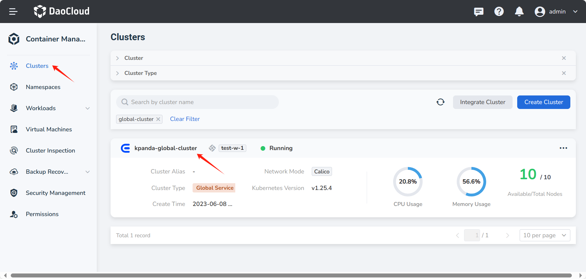
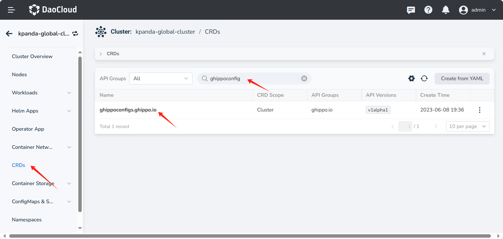
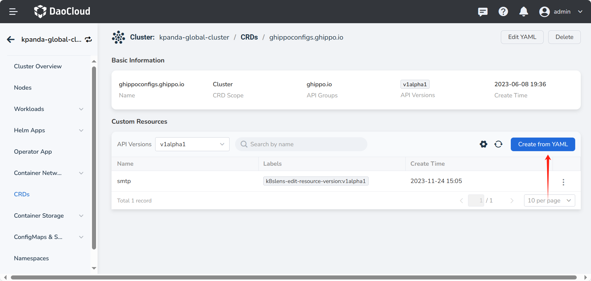

# System Messages

System messages are used to notify all users, similar to system announcements, and will be displayed
at the top bar of the DCE 5.0 UI at specific times.

## Configure System Messages

You can create a system message by applying the YAML for the system message in the
[Cluster Roles](../../kpanda/user-guide/clusters/cluster-role.md). The display time of the message is determined by
the time fields in the YAML. System messages will only be displayed within the time range configured
by the start and end fields.

1. In the Clusters, click the name of the Global Service Cluster to enter the Gobal Service Cluster.

    

2. Select __CRDs__ from the left navigation bar, search for `ghippoconfig`, and click the
   `ghippoconfigs.ghippo.io` that appears in the search results.

    

3. Click __Create from YAML__ or modify an existing YAML.

    

<!-- 4. The final result is as follows: -->

<!-- add image later -->

A sample YAML is as follows:

```yaml
apiVersion: ghippo.io/v1alpha1
kind: GhippoConfig
metadata:
  name: system-message
spec:
  message: "this is a message"
  start: 2024-01-02T15:04:05+08:00
  end: 2024-07-24T17:26:05+08:00
```
