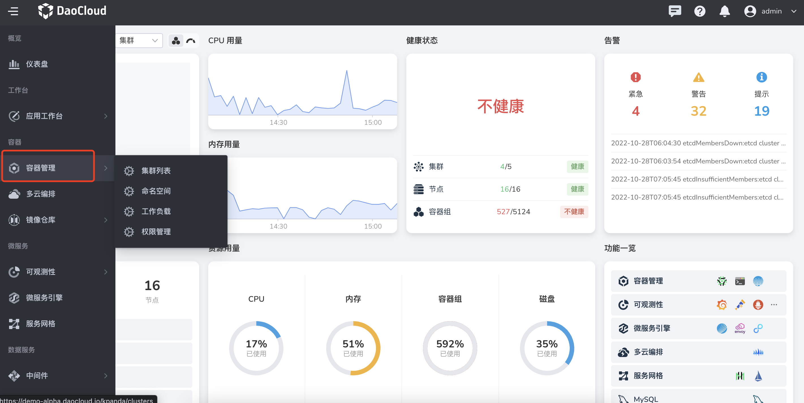

---
hide:
  - toc
---

# docking navigation bar

Take container management (codename `kpanda`) as an example, docking to the navigation bar.

The expected effect after docking is as follows:



## Docking method

Register each function item managed by the container to the navigation bar menu through GProductNavigator CR.

```yaml
apiVersion: ghippo.io/v1alpha1
kind: GProductNavigator
metadata:
  name: kpanda
spec:
  gproduct: kpanda
  name: container management
  localizedName:
    en-US: Container Management
    en-US: Container Management
  url: /kpanda
  category: container # (1)
  iconUrl: /kpanda/nav-icon.png
  order: 10 # (2)
  menus:
  - name: Backup Manager
    localizedName:
      en-US: Backup Management
      en-US: Backup Management
    iconUrl: /kpanda/bkup-icon.png
    url: /kpanda/backup
```

1. Currently only supports overview, workbench, container, microservice, data service, management, choose one of six
2. The bigger the number, the higher the number

The navigation bar `category` of the global management is configured in the ConfigMap. It cannot be added by registration for the time being. You need to contact the global management team to add it.
