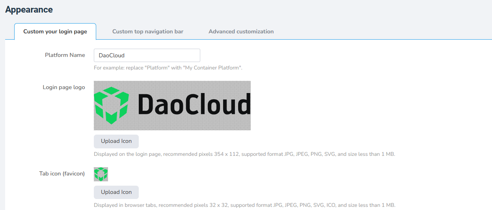
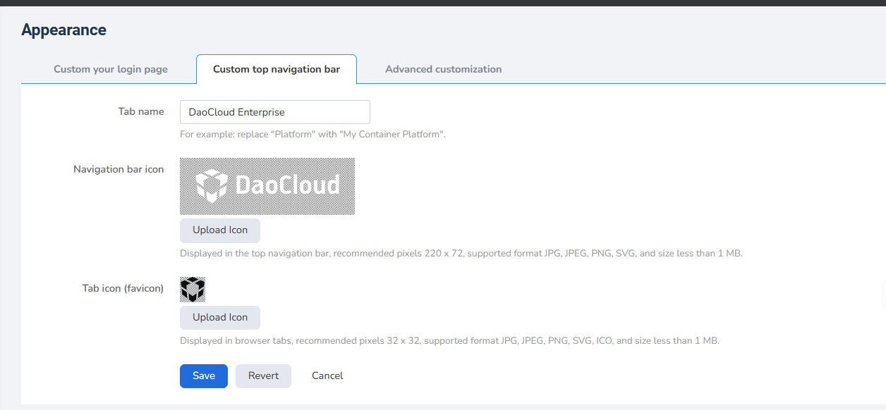

# Using OEM Before Installation

## Configure Images and Text

Create the directory structure manually as shown in the following image:


The files in `login_page` correspond to the OEM settings for the login page.



If no configuration is required, the files in `record_filing` (copyright information) and `theme` (custom styles) can be empty, but the files must still be created.

The files in `top_nav` correspond to the top navigation bar settings.



- `login_page/favicon.*`: browser tab icon.
- `login_page/icon.*`: login page icon.
- `top_nav/favicon.*`: browser tab icon.
- `top_nav/icon.*`: top navigation bar icon.

The icon filenames must not be changed. They must use the `favicon.*` and `icon.*` prefixes. Supported file types include `svg`, `jpg`, and `png`.

Modify the corresponding values in the `.yaml` files to configure the text.

`record_filing`:

```yaml
enabled: false
icp:
  copyright: "© 2009-2023 daocloud.com 版权所有"
  names:
    - name: "沪A2-20080101"
      link: false
police:
  - name: "沪B2-20080101-4"
    link: false
```

`topnav.yaml`:

```yaml
TabName: "DaoCloud Enterprise"
```

`login_page.yaml`:

```yaml
PlatformName: "DaoCloud"
Copyright: "Powered By DaoCloud"
TabName: ""
```

`Dockerfile`:

```dockerfile
FROM docker.m.daocloud.io/busybox:1.32
COPY . /daocloud/
```

## Build and Push the Image

After completing the above steps, run the following commands to build the image. Replace `xxx` with the image registry currently in use, then push the image to the registry:

```shell
docker build -t xxx/ghippo/ghippo-oem:v0.0.8 .
docker push xxx/ghippo/ghippo-oem:v0.0.8
```

## Ghippo Installation Parameters

Set `--set apiserver.oem.enabled=true` to enable OEM.

Configure the OEM image address with the following parameters:

- `--set apiserver.oem.image.registry`: configure the image registry.
- `--set apiserver.oem.image.repository`: configure the image repository.
- `--set apiserver.oem.image.tag`: configure the image tag.

These parameters must match the image that was built. Follow the Ghippo installation process to complete the OEM configuration.
