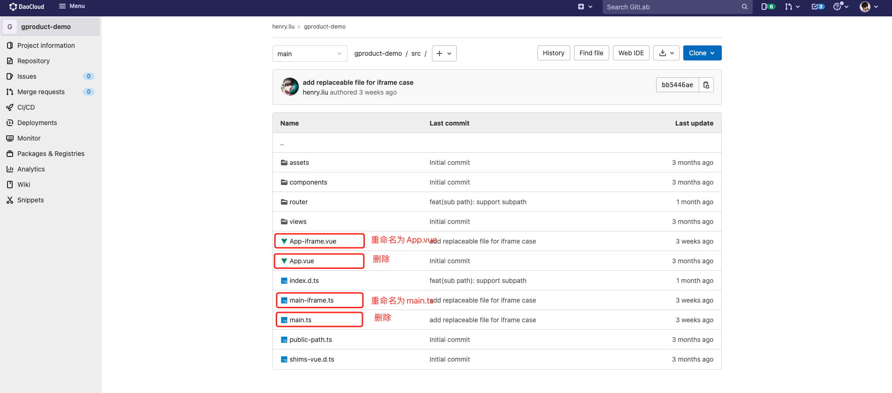

# Simulating OEM OUT with Two Sets of DCE 5.0

You can simulate the OEM OUT scenario by setting up two instances of DCE 5.0, one acting as
the customer platform and the other as DCE 5.0 itself. You can differentiate between the
customer platform and DCE 5.0 platform by modifying the login page background image and
the background color after login.

It is recommended to install the DCE 5.0 community edition. It is advisable to install
the latest version using standard Kubernetes installation (avoid using kind for installation).

The following are suggestions for using two sets of DCE 5.0!

## User Integration

If you are using two sets of DCE 5.0 for operation, it is recommended to go to
`Global Management` -> `Access Control` -> `Access Management` on the customer platform.
Fill in the obtained client information under `Identity Provider` -> `OIDC`.

Note: Only Global Management v0.17 and above support `Access Management`,
other versions require creating a client in Keycloak.

## Integrating the Navigation Bar

It is recommended to download and use the contents from this repository:

```git
git clone https://gitlab.daocloud.cn/henry.liu/gproduct-demo
```

1. Modify the following content:

    

    

2. Follow the instructions in the readme file.

    If you want to open the insight page by default after integration, you can enter
    the DCE 5.0 insight page address in the above link. Also, modify the corresponding
    integration name in the [demo.yaml](./examples/demo.yaml) file.

These are the operations for the customer platform because DCE 5.0 is used as the customer platform.
It may not be applicable in actual use cases. In real scenarios, it is important to understand the
principles and adapt accordingly.

## Consistent Styling

To differentiate the customer platform, you can adjust the styling using CSS.

Example:

```css
#app {
background-color: lightblue !important;
}
.ghippo-header {
background-color: lightseagreen!important;
}
.dao-icon.dao-iconfont.icon-service-global.dao-nav__head-icon {
color: lightseagreen !important;
}
.ghippo-header-nav-main {
background-color: lightseagreen !important;
}
.dao-nav {
background-color: rgb(20, 194, 224) !important;
}
#app > div.w-full.h-full.flex > nav > li > div > div > div > div > span {
position: relative;
}
#app > div.w-full.h-full.flex > nav > li > div > div > div > div > span::after {
position: absolute;
display: block;
content: '客户菜单';
top: 0;
bottom: 0;
left: 0;
right: 0;
background-color: #f6f8fb;
}
```

After adjustment, it will look like:


