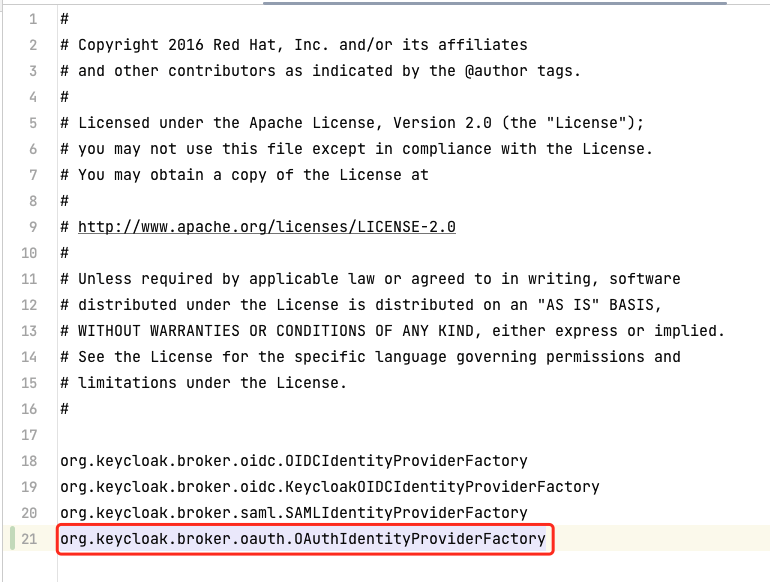

# Customizing Keycloak Identity Provider (IdP)

Requirements: keycloak >= v20

Known issue in keycloak >= v21, support for old version themes has been removed and
may be fixed in v22. See [Issue #15344](https://github.com/keycloak/keycloak/issues/15344).

This demo uses Keycloak v20.0.5.

## Source-based Development

### Configure the Environment

Refer to [keycloak/building.md](https://github.com/keycloak/keycloak/blob/main/docs/building.md)
for environment configuration.

Run the following commands based on [keycloak/README.md](https://github.com/keycloak/keycloak/blob/main/quarkus/README.md):

```sh
cd quarkus
mvn -f ../pom.xml clean install -DskipTestsuite -DskipExamples -DskipTests
```

### Run from IDE


### Add Service Code

#### If inheriting some functionality from Keycloak

Add files under the directory `services/src/main/java/org/keycloak/broker`:

The file names should be `xxxProvider.java` and `xxxProviderFactory.java`.


**[xxxProviderFactory.java](./examples/xxxProviderFactory.java) example:**

Pay attention to the variable `PROVIDER_ID = "oauth";`, as it will be used in the HTML definition later.

**[xxxProvider.java](./examples/xxxProvider.java) example:**

#### If unable to inherit functionality from Keycloak

Refer to the three files in the image below to write your own code:


**Add xxxProviderFactory to resource service**

Add xxxProviderFactory to `services/src/main/resources/META-INF/services/org.keycloak.broker.provider.IdentityProviderFactory` so that the newly added code can work:



**Add HTML file**

Copy the file `themes/src/main/resources/theme/base/admin/resources/partials/realm-identity-provider-oidc.html`
and rename it as `realm-identity-provider-oauth.html` (remember the variable to pay attention to from earlier).

Place the copied file in `themes/src/main/resources/theme/base/admin/resources/partials/realm-identity-provider-oauth.html`.

All the necessary files have been added. Now you can start debugging the functionality.

## Packaging as a JAR Plugin

Create a new Java project and copy the above code into the project, as shown below:


Refer to [pom.xml](./examples/pom.xml).

Run `mvn clean package` to package the code, resulting in the `xxx-jar-with-dependencies.jar` file.

Download [Keycloak Release 20.0.5](https://github.com/keycloak/keycloak/releases/tag/20.0.5) zip package and extract it.


Copy the `xxx-jar-with-dependencies.jar` file to the `keycloak-20.0.5/providers` directory.

Run the following command to check if the functionality is working correctly:

```sh
bin/kc.sh start-dev
```
