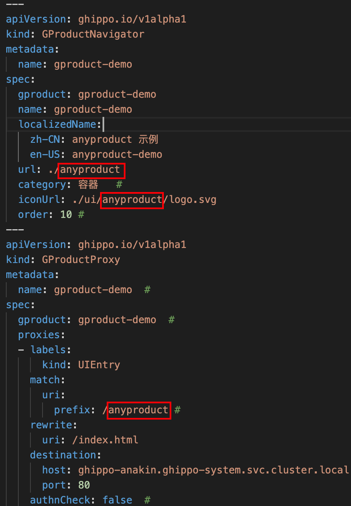

# OEM IN

OEM IN refers to the partner embedding DCE 5.0 as an Anyproduct within the DCE 5.0 platform, appearing as a submodule in the primary navigation bar. DCE 5.0 serves as the user source, and users authenticate and are managed through DCE 5.0.

AnyProduct: When a customer system needs to use DCE 5.0 as an identity provider (user source) and integrate DCE 5.0 as the portal entry point, that customer system is referred to as DCE 5.0's AnyProduct.

## How to Achieve OEM IN

### Establishing User Integration

It is necessary to integrate DCE 5.0 as the user source for unified login authentication and access to the navigation bar.

The specific steps are as follows:

1. [Integration with the Navigation Bar](../gproduct/nav.md)

2. AnyProduct integrates with DCE 5.0's user system using the OIDC protocol.

3. (Optional) If AnyProduct requires user synchronization, DCE 5.0 can provide webhook registration functionality to notify AnyProduct of user changes via webhooks.

### Embedding DCE 5.0 Interface and Using DCE 5.0 as the Portal

This step is optional.

Prerequisite: AnyProduct system itself needs to support URL prefix access (for example, in DX-ARCH, the URL needs to have a prefix).

The specific steps are as follows:

1. Deploy DCE 5.0 (assuming the access address after deployment is https://10.6.165.50:30443/) and deploy the AnyProduct system (assuming the DX-ARCH address is https://10.6.165.2:30034/).

2. You can place an Nginx reverse proxy in front of both DCE 5.0 and AnyProduct to achieve same-domain access. Configure `/` to route to DCE 5.0 and `/dx-arch/` to route to the AnyProduct system.

    1. Configure [`/etc/nginx/conf.d/default.conf`](examples/default1.conf).
    2. Configure [`/etc/nginx/nginx.conf`](examples/nginx.conf).

        

1. Assuming the Nginx entry address is 10.6.165.50, follow the steps in
   [Setting Up DCE 5.0 Reverse Proxy](../install/reverse-proxy.md) to set the DCE_PROXY as
   http://10.6.165.50/

2. Refer to the [Global Management GProduct Integration Reference Documentation](../gproduct/intro.md)
   to create an empty shell GProduct frontend sub-application and embed DX-ARCH within this
   empty shell application using an iframe.

    1. Clone this repository: https://gitlab.daocloud.cn/henry.liu/gproduct-demo

    2. In `App-iframe.vue`, modify the value of the `src` attribute to the desired relative address,
       such as `src="./dx-arch"`. If you want to navigate to http://10.6.165.50/dx-arch/ram/config/user,
       you can set it as `src="./dx-arch/ram/config/user"`.

    3. Delete `App.vue` and `main.ts`, rename `App-iframe.vue` to `App.vue`, and rename `main-iframe.ts` to `main.ts`.

    4. If you want to use the anyproduct as a subpath when accessing dx-arch in the browser,
       such as `http://{dce5_domain}/anyproduct`, make the following changes:

        1. In [nginx.conf](examples/nginx.conf), change `location ~ /ui/demo/(._)$` to `location ~ /ui/anyproduct/(._)$`.

        2. Build the image using the steps provided in [gproduct-demo](./demo.md).

        3. In [demo.yaml](./examples/demo.yaml), change the image name to the one built in the previous step
           and replace "demo" with "anyproduct" in these three places:
        
            

        4. Apply the `demo.yaml` file and the image to the DCE 5.0 cluster.

            ```sh
            docker save anyproduct-dx-arch:v0.1.0 -o ./anyproduct-dx-arch-v0.1.0.tar
            scp ./anyproduct-dx-arch-v0.1.0.tar root@10.6.165.51:~
            ssh to 51，docker load < anyproduct-dx-arch-v0.1.0.tar
            ```

### Sync User Information (Optional)

**Approach:**

Use the Webhook method to notify AnyProduct of any user changes in real time.

### Tenant Integration (Optional)

**Approach:**

Use the Webhook method to notify AnyProduct of any tenant changes in real time (can be implemented if required).

### Permission Integration (Optional)

**Approach 1:**

Customized teams can implement a custom module where DCE 5 will notify the custom module of every user login event through Webhook. The custom module can independently call AnyProduct and DCE 5.0's [OpenAPI](https://docs.daocloud.io/openapi/) for synchronizing the user's permission information.

**Approach 2:**

Use the Webhook method to notify AnyProduct of any authorization changes in real time (can be implemented if required).

### Utilizing Other Capabilities of DCE 5.0 in AnyProduct (Optional)

Approach: Use DCE 5.0's [OpenAPI](https://docs.daocloud.io/openapi/) to make API calls.

## Reference

- Refer to [OEM OUT documentation](./oem-out.md)
- Refer to [GProduct-demo integration tar package](./examples/gproduct-demo-main.tar.gz)
