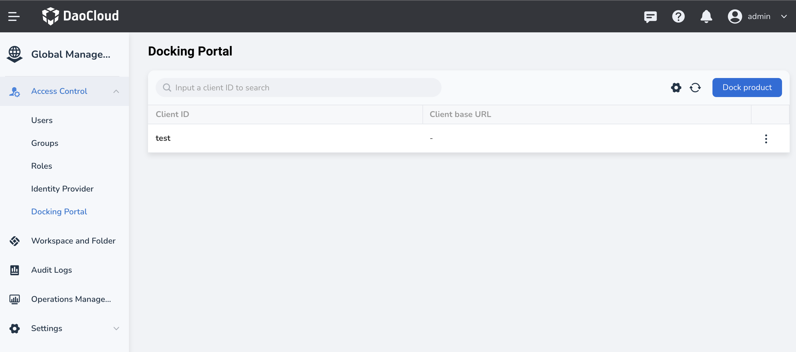
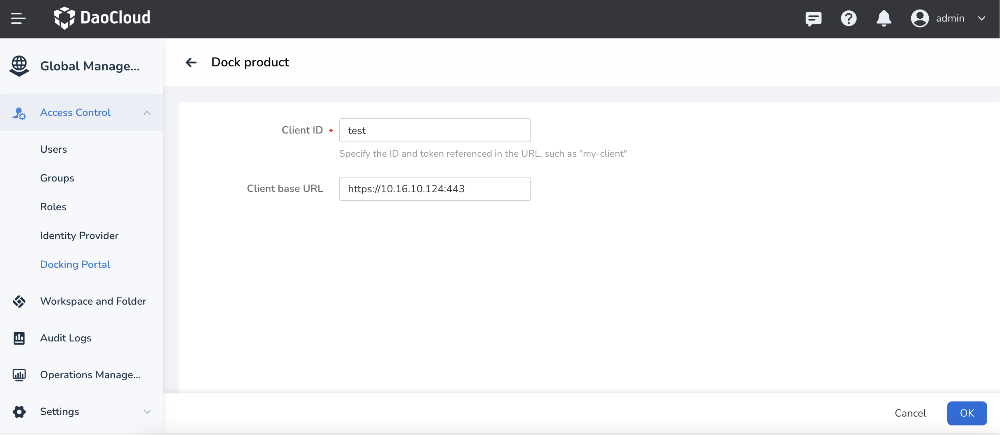

# Docking Portal

When two or more platforms need to integrate or embed with each other,
user system integration is usually required. During the process of user system integration,
the `Docking Portal` mainly provides SSO (Single Sign-On) capability.
If you want to integrate DCE 5.0 as a user source into a client platform,
you can achieve it by docking a product through `Docking Portal`.

## Docking a product

Prerequisite: Administrator privileges for the platform or IAM Admin privileges
for access control.

1. Log in with an admin, navigate to `Access Control`, select `Docking Portal`,
   enter the Docking Portal list, and click `Dock product` in the upper right corner.

    

2. On the `Dock product` page, fill in the Client ID.

    

3. After successfully creating the SSO access, in the Docking Portal list,
   click the just created Client ID to enter the details,
   copy the Client ID, Secret Key, and Single Sign-On URL information,
   and fill them in the client platform to complete the user system integration.

    
