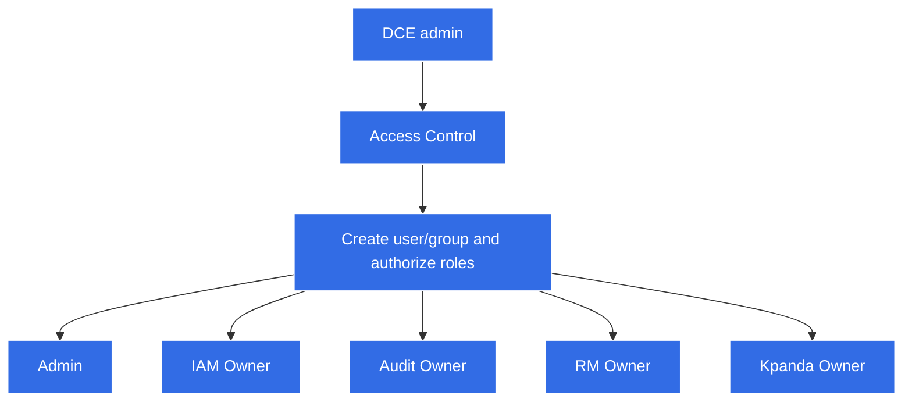

# Global management mode

## Applicable scenarios

If you need to set up administrators for sub-modules to further manage user/group permissions through administrators, you can use roles in Access Control. Possessing this role means having the highest administrative authority for this submodule.

!!! note

    There are three modes of permission management, currently the global management mode. The role in the access control represents the highest authority of each sub-module. See [Access Management](role.md) for details.

A role corresponds to a set of permissions. Permissions determine the actions that can be performed on a resource. Granting a role to a user grants all the permissions included in the role.

## Access control roles

Four roles are predefined in Access Control, namely: Admin, IAM Owner, Audit Owner, and Kpanda Owner. These 4 roles are created by the system, and users can only use them and cannot modify them. The permissions corresponding to the role are as follows:

| Role Name | Role Type | Belonging Module | Role Permissions |
| ------------ | -------- | -------------- | ------------ --------------------------------------------------- |
| Admin | System role | All | Platform administrator, managing all platform resources, representing the highest authority of the platform |
| IAM Owner | System Role | Access Control | Administrator of Access Control, who has all permissions under the service, such as managing users/groups and authorization |
| Audit Owner | System Role | Audit Log | The administrator of the audit log has all the permissions under this service, such as setting the audit log policy and exporting the audit log |
| Kpanda Owner | System Role | Container Management | The administrator of container management has all the permissions under this service, such as creating/accessing clusters, deploying applications, and granting cluster/namespace-related permissions to users/groups |