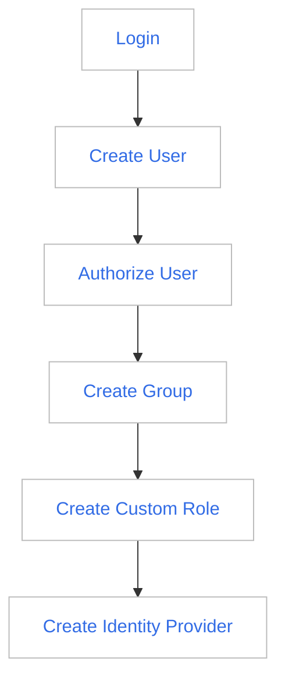

# What is IAM

IAM (Identity and Access Management) is an important module of global management. You can create, manage and destroy users (groups) through the access control module, and use system roles and custom roles to control other users Access to the DCE Platform.

## Benefits

- Simple and smooth

    Structures and roles within an enterprise can be complex, with the management of projects, work groups, and mandates constantly changing. Access control uses a clear and tidy page to open up the authorization relationship between users, groups, and roles, and realize the authorization of users (groups) with the shortest link.

- Appropriate role

    Access control pre-defines an administrator role for each sub-module, without user maintenance, you can directly authorize the predefined system roles of the platform to users to realize the modular management of the platform. For fine-grained permissions, please refer to [Permission Management](role.md).

- Enterprise-grade access control

    When you want your company's employees to use the company's internal authentication system to log in to the DCE platform without creating corresponding users on the DCE platform, you can use the identity provider feature of access control to establish a trust relationship between your company and DCE, Through joint authentication, employees can directly log in to the DCE platform with the existing account of the enterprise, realizing single sign-on.

## Usage Process

Here is a typical process to perform access control.

