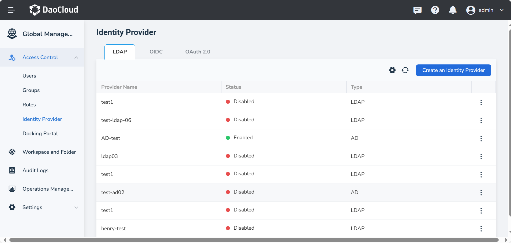
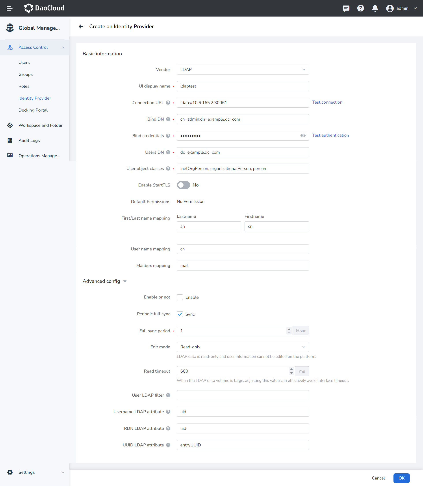

---
hide:
  - toc
---

# LDAP

The full name of LDAP is Lightweight Directory Access Protocol, which is an open and neutral
industry-standard application protocol that provides access control and maintains directories
for distributed information through the IP protocol.

If your enterprise or organization has its own account system, and your enterprise user management
system supports the LDAP protocol, you can use the identity provider feature based on the LDAP protocol
provided by the Global Management instead of creating usernames/passwords for each member in DCE 5.0.
You can grant permissions to use DCE 5.0 resources to these external user identities.

In Global Management, the operation steps are as follows:

1. Log in to DCE 5.0 as a user with __admin__ role. Click __Global Management__ -> __Access Control__
   in the lower left corner of the left navigation bar.

    

1. Click __Identity Provider__ on the left nav bar, click __Create an Identity Provider__ button.

    

1. In the __LDAP__ tab, fill in the following fields and click __Save__ to establish a trust relationship
   with the identity provider and a user mapping relationship.

    

    | Field | Description |
    | ----- | ----------- |
    | Vendor | Supports LDAP (Lightweight Directory Access Protocol) and AD (Active Directory) |
    | Identity Provider Name (UI display name) | Used to distinguish different identity providers |
    | Connection URL | The address and port number of the LDAP service, e.g., ldap://10.6.165.2:30061 |
    | Bind DN | The DN of the LDAP administrator, which Keycloak will use to access the LDAP server | cn=admin,dc=daocloud,dc=com |
    | Bind credentials | The password of the LDAP administrator. This field can retrieve its value from a vault using the ${vault.ID} format. |
    | Users DN | The full DN of the LDAP tree where your users are located. This DN is the parent of the LDAP users. For example, if the DN of a typical user is similar to “uid='john',ou=users,dc=example,dc=com”, it can be “ou=users,dc=example,dc=com”. | dc=daocloud,dc=io |
    | User Object Classes | All values of the LDAP objectClass attribute for users in LDAP, separated by commas. For example: “inetOrgPerson,organizationalPerson”. New Keycloak users will be written to LDAP with all of these object classes, and existing LDAP user records will be found if they contain all of these object classes.|
    | Enable StartTLS | Encrypts the connection between DCE 5.0 and LDAP when enabled |
    | Default Permission | Users/groups have no permissions by default after synchronization |
    | Full name mapping | Corresponding First name and Last Name |
    | User Name Mapping | The unique username for the user |
    | Mailbox Mapping | User email |

    **Advanced Config**

    | Field | Description |
    | ----- | ----------- |
    | Enable or not | Enabled by default. When disabled, this LDAP configuration will not take effect. |
    | Periodic full sync | Disabled by default. When enabled, a sync period can be configured, such as syncing once every hour. |
    | Edit mode | Read-only mode will not modify the source data in LDAP. Write mode will sync data back to LDAP after user information is edited on the platform. |
    | Read timeout | Adjusting this value can effectively avoid interface timeouts when the amount of LDAP data is large. |
    | User LDAP filter | An additional LDAP filter used to filter the search for users. Leave it empty if no additional filter is needed. Ensure it starts with “(” and ends with “)”. |
    | Username LDAP attribute | The name of the LDAP attribute maps to the Keycloak username. For many LDAP server vendors, it can be “uid”. For Active Directory, it can be “sAMAccountName” or “cn”. This attribute should be filled in for all LDAP user records you want to import into Keycloak. |
    | RDN LDAP attribute | The name of the LDAP attribute that serves as the RDN (top-level attribute) of the typical user DN. It is usually the same as the Username LDAP attribute, but this is not required. For example, for Active Directory, when the username attribute might be “sAMAccountName”, “cn” is often used as the RDN attribute. |
    | UUID LDAP attribute | The name of the LDAP attribute used as the unique object identifier (UUID) for objects in LDAP. For many LDAP server vendors, it is “entryUUID”. However, some may differ. For example, for Active Directory, it should be “objectGUID”. If your LDAP server does not support the UUID concept, you can use any other attribute that should be unique among LDAP users in the tree, such as “uid” or “entryDN”. |

1. On the __Sync Groups__ tab, fill in the following fields to configure the mapping relationship of
   groups, and click __Save__ again.

    | Field | Description | Example |
    | ----- | ----------- | ------- |
    | base DN | location of the group in the LDAP tree | ou=groups,dc=example,dc=org |
    | Usergroup Object Filter | Object classes for usergroups, separated by commas if more classes are required. In a typical LDAP deployment, usually "groupOfNames", the system has been filled in automatically, if you need to change it, just edit it. * means all. | * |
    | group name | cn | Unchangeable |

!!! note

    1. After you have established a trust relationship between the enterprise user management system
       and DCE 5.0 through the LDAP protocol, you can synchronize the users or groups in the enterprise
       user management system to DCE 5.0 at one time through auto/manual synchronization.
    1. After synchronization, the administrator can authorize groups/groups in batches, and users
       can log in to DCE 5.0 through the account/password in the enterprise user management system.
    1. See the [LDAP Operations Demo Video](../../../videos/ghippo.md#integration-with-ldap-users-and-user-groups) for a hands-on tutorial.
