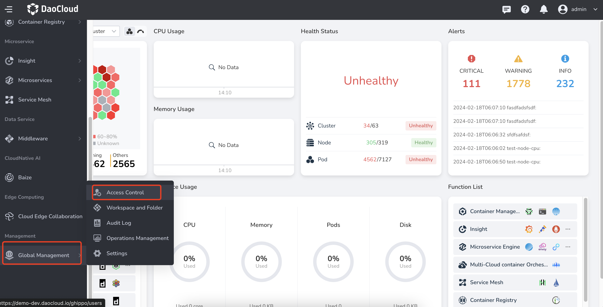
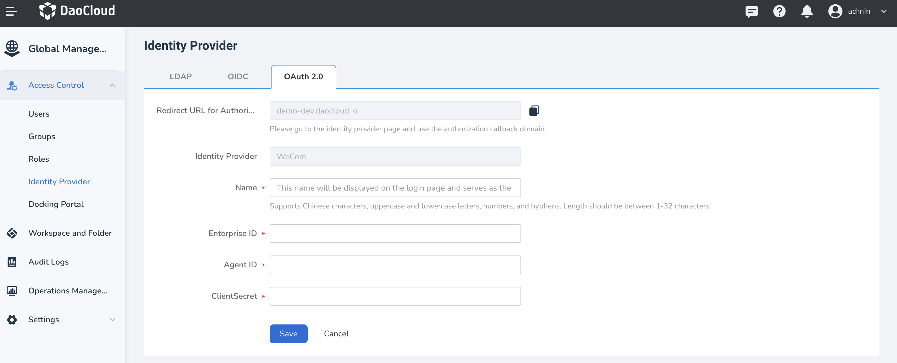

# OAuth 2.0 - WeCom

If all members in your enterprise or organization are managed in WeCom, you can use the
identity provider feature based on the OAuth 2.0 protocol provided by Global Management,
without the need to create a username/password for each organization member in DCE 5.0.
You can grant these external user identities permission to use DCE 5.0 resources.

## Steps

1. Log in to DCE 5.0 with a user who has the **admin** role. Click
   **Global Management** -> **Access Control** at the bottom of the left navigation bar.

    

2. Select **Identity Providers** on the left navigation bar, and click the **OAuth 2.0** tab.
   Fill in the form fields and establish a trust relationship with WeCom, then click **Save**.

    

## Corresponding fields in WeCom

!!! note

    Before integration, you need to create a custom application in the WeCom management console. Refer to
    [How to create a custom application link](https://open.work.weixin.qq.com/help2/pc/16892?person_id=1&searchData=)

    | Field        | Description        |
    | ----------- | ---------------|
    | Corp ID      | ID of WeCom  |
    | Agent ID    | ID of the custom application     |
    | ClientSecret | Secret of the custom application |

WeCom ID:

Agent ID and ClientSecret:

