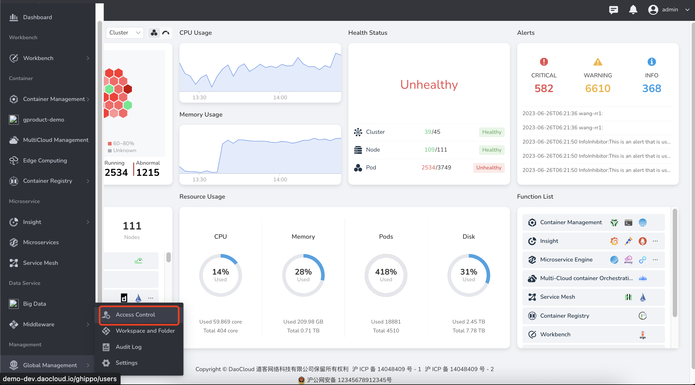

# OIDC

OIDC (OpenID Connect) is an identity layer based on OAuth 2.0 and an identity authentication standard protocol based on the OAuth2 protocol.

If your enterprise or organization already has its own account system, and your enterprise user management system supports the OIDC protocol, you can use the OIDC protocol-based identity provider feature provided by the global management instead of creating an account for each organization in DCE 5.0. Members create username/password.
You can grant permissions to use DCE 5.0 resources to these external user identities.

The specific operation steps are as follows.

1. Log in to DCE 5.0 as a user with `admin` role. Click `Global Management` -> `Access Control` at the bottom of the left navigation bar.

    

2. On the left nav bar select `Identity Providers`, click the `OIDC` tab.
   After completing the form fields and establishing a trust relationship with the identity provider, click `Save`.

    

    | Field | Description |
    | ---------- | -------------------------------------- ---------------------- |
    | Redirect URL | URL to redirect to DCE 5.0 |
    | provider name | displayed on the login page and is the entry point for the identity provider |
    | Authentication Method | Client authentication method. If the JWT is signed with a private key, select `JWT signed with private key` from the dropdown. For details, refer to [Client Authentication](https://openid.net/specs/openid-connect-core-1_0.html#ClientAuthentication). |
    | Client ID | Client's ID |
    | Client Secret | Client Secret |
    | Client URL | One-click access to login URL, Token URL, user information URL and logout URL through the identity provider's well-known interface |
    | Auto-associate | After it is turned on, when the identity provider username/email is duplicated with the DCE 5.0 username/email, the two will be automatically associated |

!!! note

    1. After the user completes the first login to DCE 5.0 through the enterprise user management system, the user information will be synchronized to `Access Control` -> `User List` of DCE 5.0.
    1. Users who log in for the first time will not be given any default permissions and need to be empowered by an administrator (the administrator can be a platform administrator, submodule administrator or resource administrator).
    1. For practical tutorials, please refer to [OIDC Operation Demo Video](../../../videos/ghippo.md#oidc), or refer to [Azure OpenID Connect (OIDC) Access Process](https ://learn.microsoft.com/en-us/azure/active-directory/develop/v2-protocols-oidc).

## User identity authentication interaction process

The interactive process of user authentication is as follows:

1. Use a browser to initiate a single sign-on request for DCE 5.0.
1. According to the information carried in the login link, DCE 5.0 searches for the corresponding configuration information in `Global Management` -> `Access Control` -> `Identity Provider`, constructs an OIDC authorization Request, and sends it to the browser.
1. After the browser receives the request, it forwards the OIDC authorization Request to the enterprise IdP.
1. Enter the username and password on the login page of the enterprise IdP. The enterprise IdP verifies the provided identity information, constructs an ID token carrying user information, and sends an OIDC authorization response to the browser.
1. After the browser responds, it forwards the OIDC authorization Response to DCE 5.0.
1. DCE 5.0 takes the ID Token from the OIDC Authorization Response, maps it to a specific user list according to the configured identity conversion rules, and issues the Token.
1. Complete single sign-on to access DCE 5.0.