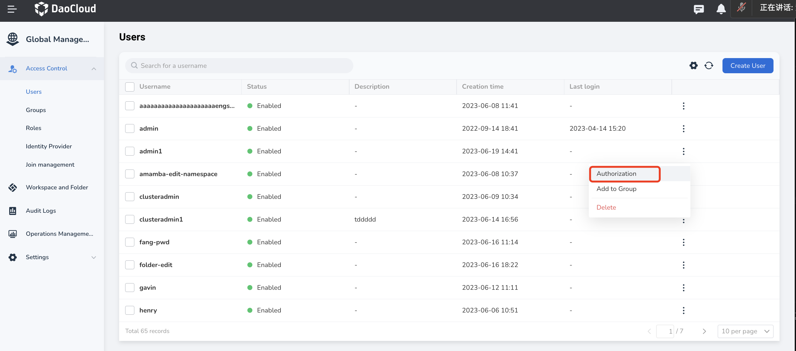
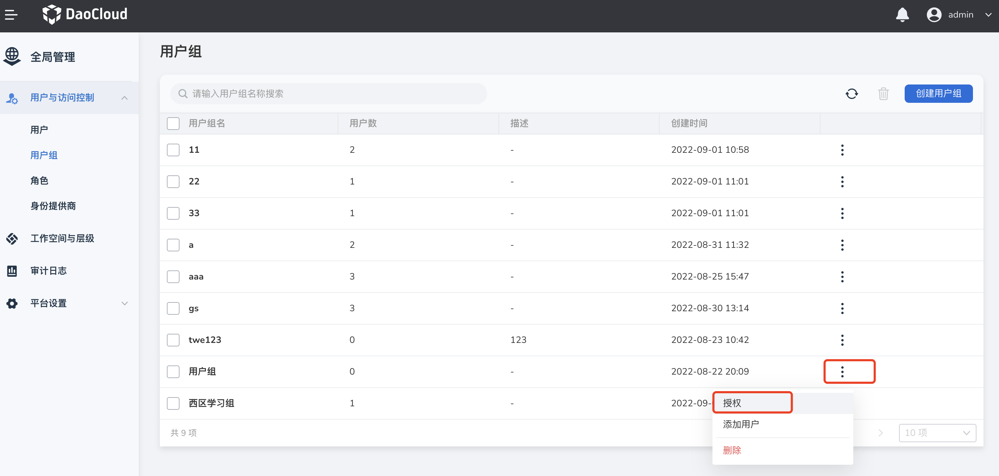
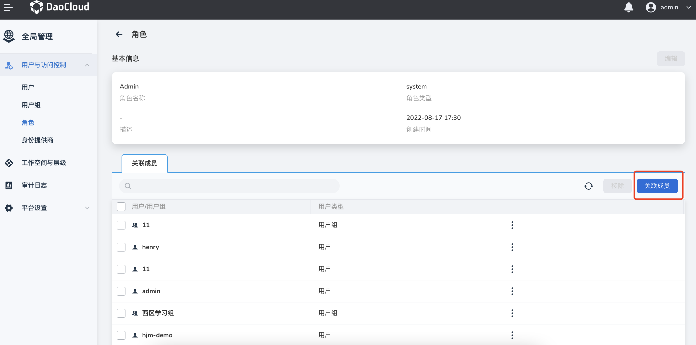

# Role and permission management

A role corresponds to a set of permissions. Permissions determine the actions that can be performed on a resource. Granting a role to a user grants all the permissions included in the role.

There are the following three modes of rights management, which can flexibly and effectively solve your use problems on rights:

- Global management mode
- Submodule management mode
- Resource-based management model

## Global management mode

The global management mode refers to the way you configure permissions for users (groups) through system roles in the global management module.
The platform predefines an administrator role for each sub-module, which is used to realize the block management of sub-modules.
For example, the IAM Owner of access control, the Kpanda Owner of container management, etc., each sub-module administrator has the highest authority of the module.
The submodule administrator role needs to be configured in the global management module, which can be obtained in the following ways:

- Find the user in the user list of `Global Management` -> `Access Control` -> `User`; click `...`, select `Authorization`, and assign the user a predefined submodule of the system Administrator permissions.

    

- Create a group in the group list of `Global Management` -> `Access Control` -> `group`, add the user to the group, and authorize the group (the specific operation is: in the group list Find the group, click `...`, select `Authorization`, and give the group the pre-defined sub-module administrator rights of the system).

    

- In the role list of `Global Management` -> `Access Control` -> `Roles`, find the corresponding submodule administrator role, click the role name to enter the details, click the `Associate Member` button, select the user or The group to which the user belongs, click `OK`.

    

Submodules that support this mode: Access Control (IAM), Audit Log (Audit), Container Management (Kpanda)
At the same time, the administrator role (Admin) of the platform can also be authorized through the above methods

!!! note

    - Admin platform administrator
    - IAM Owner access control module administrator
    - Kpanda Owner container management module administrator
    - Audit Owner Audit log module administrator

## Submodule management mode

The sub-module management mode means that you can assign different resources to different users on demand through sub-modules, and at the same time, different users can have different usage permissions for the same resource.
The platform predefines three roles for each resource in the submodule, namely Admin, Editor and Viewer.

- The Admin role has administrative rights to the resource and can authorize the resource to be used by others;
- The Editor role has permission to use resources and can edit and view resources;
- The Viewer role has view-only access to resources.

For example, the NS Admin role in Namespace01 under cluster A in container management can manage, edit, and view Namespace01, and can authorize other users to NS Admin, NS Editor, and NS Viewer roles.
The NS Editor role of Namespace01 can edit and view Namespace01, and can deploy applications.
The Viewer role for Namespace01 can only view Namespace01.

Submodules that support this mode: [Container Management](../../../kpanda/intro/what.md)

You can go to `Container Management` -> `Privilege Management`, select `Add Authorization` to grant Cluster or Namespace permissions to users/groups.

!!! note

    In this manual, Cluster refers to cluster; NS is the abbreviation of Namespace, that is, namespace.

## Resource-Based Management Mode

1. The resource-based management mode depends on the workspace and applies the role permissions of users/user groups in the workspace to the resources under the workspace through a centralized and unified access control policy, achieving cross-submodule authorization for users (user groups) to access resources. For example, if user A is a Workspace Editor role in Workspace 01, they have Editor permissions for all resources under Workspace 01. A workspace usually refers to a project or environment, and the resources in each workspace are physically isolated from those in other workspaces. You can grant different access permissions to users (user groups) for the same group of resources through "Authorization" in the workspace. At the same time, the workspace contains various types of resources in different modules, and different types of resources are presented differently in the workspace.

    - Module Name: [Application Workspace](../../../amamba/intro/what.md), [Microservice Engine](../../../skoala/intro/what.md)

        Because these modules do not support the authorization modes of global management mode and submodule management mode, they rely solely on the workspace for authorization. Therefore, all resources are created under the workspace. After creation, the resources are automatically bound to the workspace to ensure that they can be authorized and used after creation. After these resources are created, they will not be automatically displayed in the resource group or shared resources of the workspace and can only be presented in the resource list of each module. (Any role with a Workspace role can enter the above modules)

    - [Container Management](../../../kpanda/intro/what.md)

        Container Management supports three authorization modes: global management mode, submodule management mode, and resource-based management mode. Therefore, in the Container Management module, you can choose to grant users/user groups the Kpanda Owner role through the User and Access Control module, or grant users/user groups the corresponding permissions for a resource through the permission management function of the Container Management module, or inherit the role permissions of users/user groups in the workspace by binding resources (clusters or Namespaces) to the workspace. Because there are two states of bound and unbound workspaces for resources in Container Management, to distinguish between the two different states, resources bound to the workspace will be presented in the workspace-resource group, and both the workspace-resource group and the resource list of Container Management provide binding/unbinding entry points for resources. (Admin role or Workspace Admin + Kpanda Owner role can perform resource binding)

    - [Service Mesh](../../../mspider/intro/what.md)

        Due to the special nature of its own resources, Service Mesh also has two states of bound and unbound. Therefore, you can manage the resources in Service Mesh through the Admin role, or bind resources (Mesh or Mesh-Namespace) to the workspace to enable users/user groups to obtain permissions for resources in Service Mesh through the workspace. The bound resources will be displayed in the resource group of the workspace. Currently, only the Service Mesh module provides a resource binding entry point. (Admin role can perform resource binding)

2. Submodules that support this mode: Application Workspace, Microservice Engine, Middleware, Container Management, Service Mesh.

3. You can create a workspace through `Global Management` -> `Workspace and Folders`, and grant users/user groups Workspace Admin, Workspace Editor, Workspace Viewer roles in `Workspace` -> `Authorization`.

!!! note

    Resource refers to the specific data created on the DCE platform through various submodules. Typically, a resource describes one or more objects to be operated on, and each submodule has its own resources and corresponding resource definition details, such as clusters, Namespaces, and gateways. The owner of the resource is the Super Admin account, which has the permission to create/manage/delete resources in each submodule. Ordinary users will not automatically have access permissions to resources without authorization by the resource owner. Usually, the resource owner will add a group of resources to a workspace and then authorize users (user groups) through the workspace to grant them operating permissions for certain resources.
