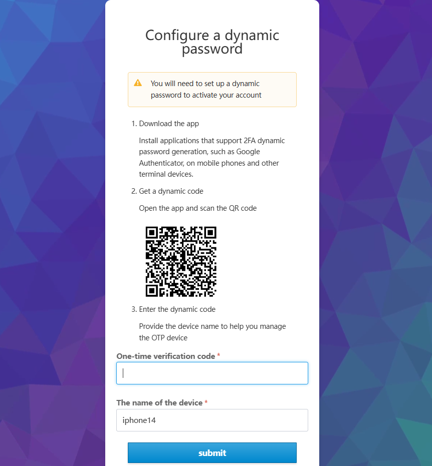

# Reset Password

If you forget your password, you can reset it by following the instructions on this page.

## Steps to Reset Password

When an administrator initially creates a user, it sets a username and password for him.
After the user logs in, fill in the email address and change the password in __Personal Center__ .
If the user has not set an email address, he can only contact the administrator to reset the password.

1. If you forget your password, you can click __Forgot your password?__ on the login interface.

      

1. Enter your login email and click __Submit__ .

      

1. Find the password reset email in the mailbox, and click the link in your email. The link is effective for 5 minutes.

         

1. Install applications that support 2FA dynamic password generation (such as Google Authenticator) on mobile phone 
   or other devices. Set up a dynamic password to activate your account, and click __Submit__ .

        

1. Set a new password and click __Submit__ . The requirements for setting a new password are consistent with 
   the password rules when creating an account.

       

1. The password is successfully reset, and you enter the home page directly.  

## Reset password process

The flow of the password reset process is as follows.

