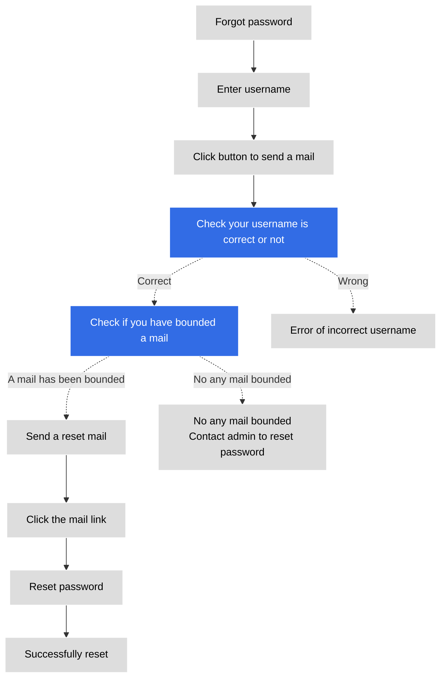

# Reset Password

If you forget your password, you can reset it by following the instructions on this page.

## Reset password steps

When an administrator initially creates a user, it sets a username and password for it.
After the user logs in, fill in the email address and change the password in __Personal Center__ .
If the user has not set an email address, he can only contact the administrator to reset the password.

1. If you have forgotten your password, you can click __Forgot password?__ on the login screen.

    

1. Enter your username and click __Submit__ .

    To prevent spam, after clicking 'Submit', the button will be grayed out and a 1-minute countdown will be displayed.
    If you haven't received the email after 1 minute, please click this button again.

    

1. Find the password reset email in the mailbox, and click the link in your email.

    

1. Follow the screen prompts to set a new password and click __Submit__ . The requirements for setting a new password are consistent with the password rules when creating a user.

    

1. The screen prompts that the password has been changed successfully or directly log in to the DCE main screen.

    

## Reset password process

The flow of the password reset process is as follows.

