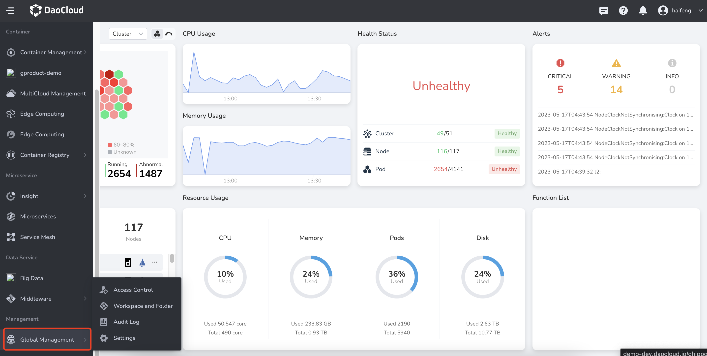
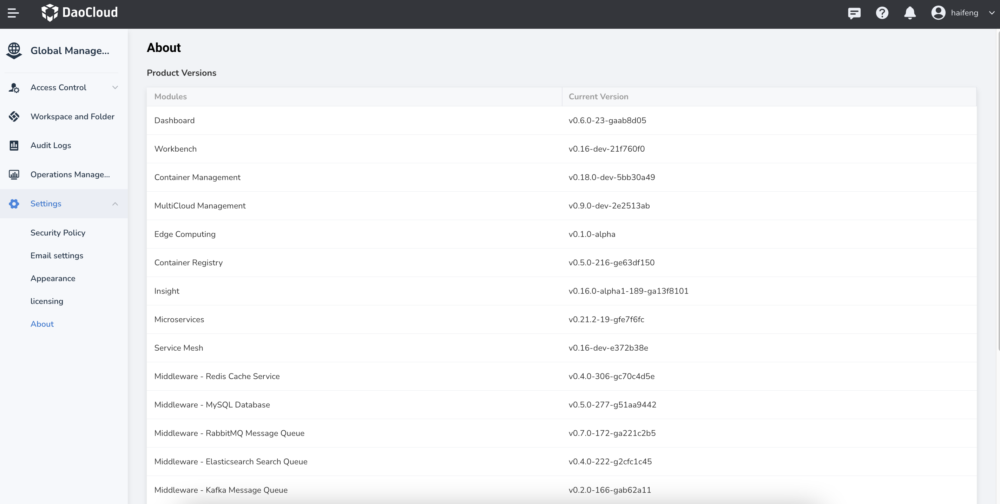
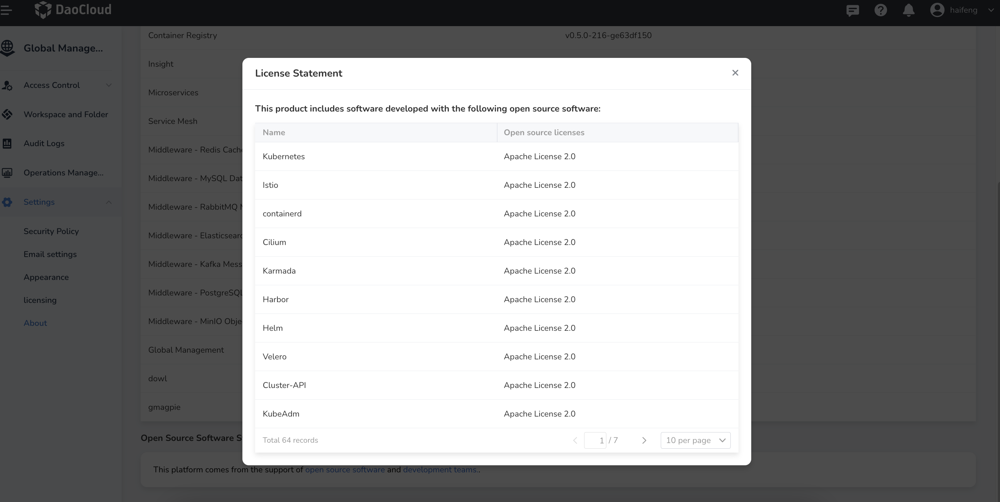
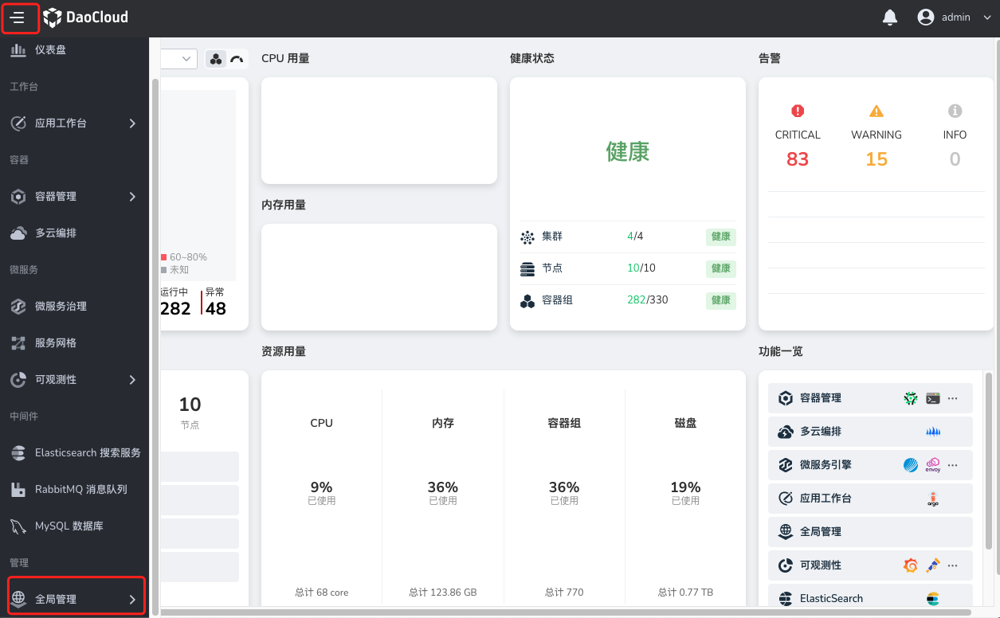

---
hide:
  - toc
---

# About the platform

The `About` page primarily showcases the latest versions of each module, highlights the different open source software used, and expresses gratitude to the technical team via an animated video.

A simple step to view is as follows:

1. Log in to the web console as a user with `Admin` role. Click `Global Management` at the bottom of the left navigation bar.

    

2. Click `Settings`, select `About`, and check the product version, open source software statement, and development teams.

    

    **License Statement**

    

    **Technical Team**

    
