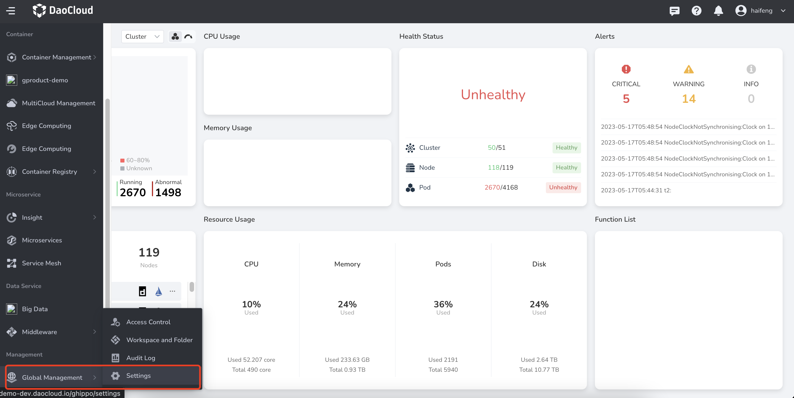
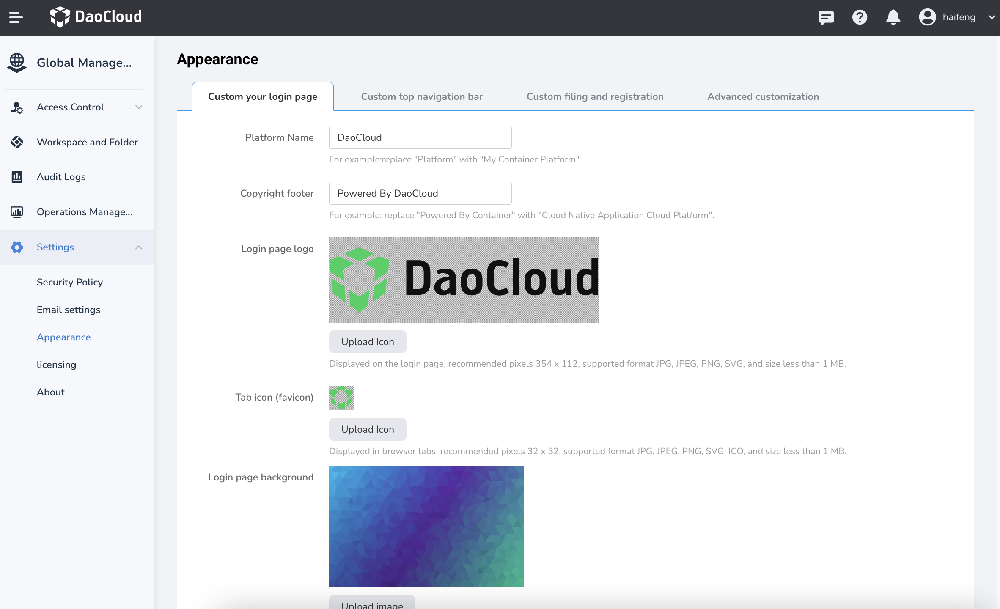
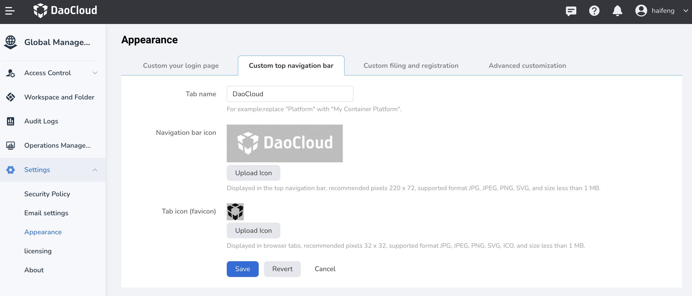
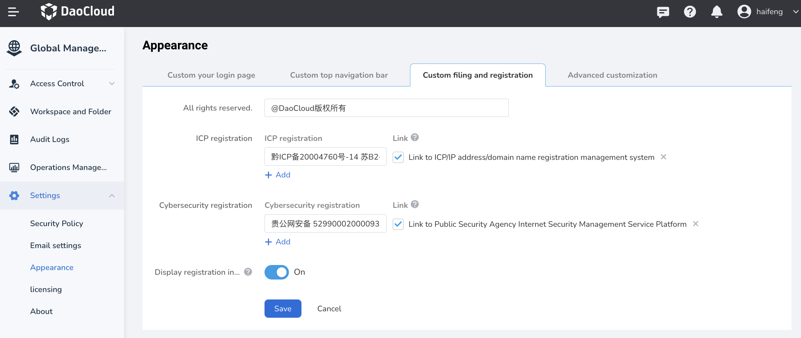
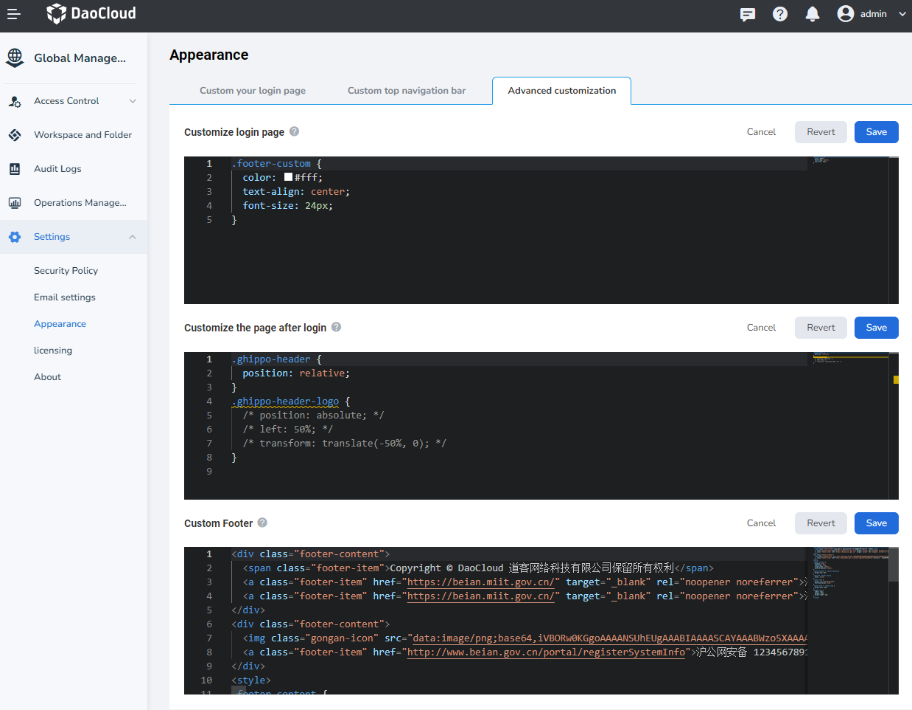

---
hide:
  - toc
---

# Customize Appearance

In DCE 5.0, you have the option to customize the appearance of the login interface and top navigation bar to enhance product recognition for your users.

## Customizing Login Page and Top Navigation Bar

1. To get started, log in to the web console as an `admin` user and navigate to `Global Management` -> `Settings` found at the bottom of the left navigation bar.

    

2. Select `Appearance`. On the `Custom your login page` tab, modify the icon and text of the login page as needed, then click `Save`.

    

3. On the `Custom top navigation bar` tab, modify the icon and text of the navigation bar as needed, then click `Save`.

    

4. On the `Custom filing and registration` tab, modify the ICP registration and cybersecurity infomration.

    

!!! note

    If you wish to restore the default settings, simply click `Revert`. This action will discard all customized settings.

## Advanced Customization

Advanced customization allows you to modify the color, font spacing, font size, etc. of the entire container platform using CSS styles. Please note that familiarity with CSS syntax is required.



To reset any advanced customizations, delete the contents of the black input box or click the `Revert` button.

**Sample CSS for Login Page Customization:**

```css
.test {
  width: 12px;
}

#kc-login {
 /* color: red!important; */
}
```

**CSS sample for page customization after login:**

```css
.dao-icon.dao-iconfont.icon-service-global.dao-nav__head-icon {
   color: red!important;
}
.ghippo-header-logo {
  background-color: green!important;
}
.ghippo-header {
  background-color: rgb(128, 115, 0)!important;
}
.ghippo-header-nav-main {
  background-color: rgb(0, 19, 128)!important;
}
.ghippo-header-sub-nav-main .dao-popper-inner {
  background-color: rgb(231, 82, 13) !important;
}
```
