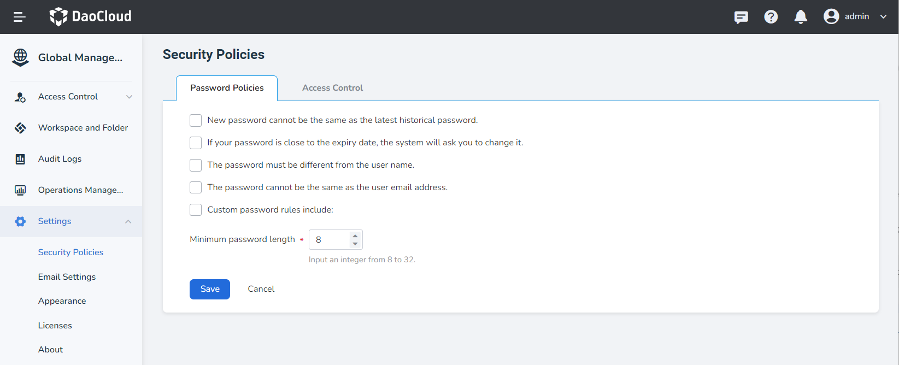

# security strategy

DCE 5.0 provides security policies based on passwords and access control on the graphical interface.

**Password Policy**

- The new password cannot be the same as the most recent historical password.
- After the password expires, the system will force you to change the password.
- the password and username can not not be the same.
- The password cannot be the same as the user's email address.
- Customize password rules.
- Custom password minimum length.

**Access Control Policy**

- Session timeout policy: The user will log out of the current account if there is no operation within x hours.
- Account lockout policy: If you fail to log in multiple times within the time limit, your account will be locked.
- Login/logout policy: Log out while closing the browser.

After entering the global management, click __Settings__ -> __Security Policy__ in the left navigation bar to set the password policy and access control policy.

