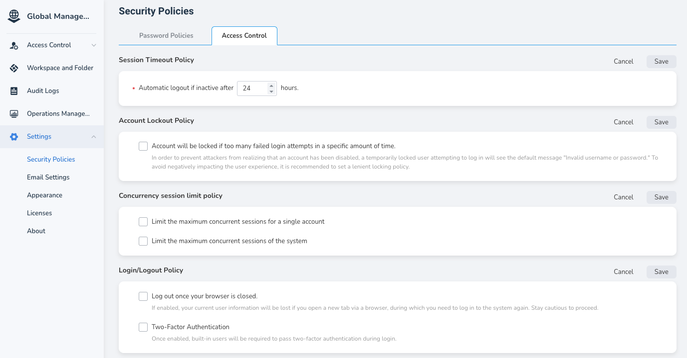

# Security Policy

DCE 5.0 offers robust security measures, including password policies and access control for the graphical interface.

## Password Policy

- New passwords must differ from the most recent historical password.
- Users are required to change their passwords upon expiration.
- Passwords must not match the username.
- Passwords cannot be the same as the user's email address.
- Customizable password rules.
- Customizable minimum password length.

## Access Control Policy

- Session Timeout Policy: If a user does not perform any operations within x hours,
  they will be logged out of their current account.
- Account Lockout Policy: If there are multiple failed login attempts within a specified
  period, the account will be locked.
- Limit the maximum number of concurrent session connections for a single account:
  To prevent a single user from consuming excessive server resources or to prevent
  malicious users from attacking the system by creating a large number of concurrent
  connections, a limit is set. This ensures that each user can only establish a certain
  number of concurrent connections, thereby protecting the stability and security of
  the server.
  
    !!! note

        Once a single account reaches the maximum concurrency, other devices must be manually logged out
        to log in to a new device, which may cause operational inconvenience. Please proceed with caution.
        (Closing the page does not count as logging out; you need to manually click **Logout** )

- Limit the maximum number of concurrent session connections for the system: This restricts the maximum number
  of session connections that the entire system (rather than a single account) can handle or allow at the same time,
  thereby protecting system resources from excessive consumption and ensuring system stability and performance.
- Log out when closing the browser: When enabled, opening a new tab in the browser will cause
  the user information to be lost, requiring a new login. Please operate with caution.
- Two-Factor Authentication (2FA): This is a security verification process used to enhance the security
  and reliability of user accounts. In this process, two different authentication factors,
  a username/password and a verification code, are provided to prove identity, thereby increasing
  the difficulty for attackers to access user devices and online accounts.

After entering global management, click __Platform Settings__ -> __Security Policy__
in the left navigation bar to set the password policy and access control policy.

### Two-Factor Authentication

After enabling two-factor authentication, users will need to perform a secondary verification when logging in.

**First Login**

1. After enabling two-factor authentication, users need to install an application that supports
   2FA verification code generation, such as Google Authenticator, on their mobile devices or other terminal devices.

2. Open the application and scan the QR code.

3. Enter the verification code and click **Submit** to log in successfully.

**Second Login**

On the login page, after entering the username and password, open the verification code
generation application like Google Authenticator, enter the verification code,
and click **Login** to log in successfully.
