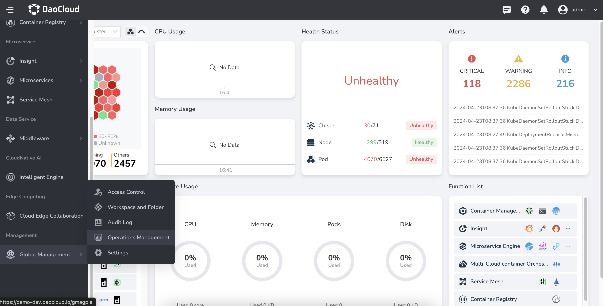

# Accounting and Billing

Accounting and billing further process the usage data of resources based on reports.
You can manually set the unit price and currency unit for CPU, memory, and storage.
After setting, the system will automatically calculate the expenses of clusters, nodes, pods,
namespaces, and workspaces over a period. You can adjust the period freely and export
billing reports in Excel or Csv format after filtering by week, month, quarter, or year.

## Billing Rules and Effective Time

- Billing Rules: Default billing is based on the maximum value of request and usage.
- Effective Time: Effective the next day, the fees incurred on that day are calculated
  based on the unit price and quantity obtained at midnight the next day.

## Features

- Support customizing the billing unit for CPU, memory, and storage, as well as the currency unit.
- Support custom querying of billing data within a year, automatically calculating the
  billing situation for the selected time period.
- Support exporting billing reports in CSV and Excel formats.
- Support enabling/disabling individual billing reports. After enabling/disabling, the platform will
  start/stop collecting data within 20 minutes, and past collected data will still be displayed normally.
- Support selective display of billing data for CPU, total memory, storage, and total.

## Report Dimensions

Currently, the following reports are supported:

- Cluster Billing Report: Displays the CPU billing, memory billing, storage billing, and overall
  billing situation for all clusters within a certain period, as well as the number of nodes in
  that cluster. By clicking the number of nodes, you can quickly enter the node billing report and view the billing situation of nodes in that cluster during that time period.
- Node Billing Report: Displays the CPU billing, memory billing, storage billing, and overall billing situation for all nodes within a certain period, as well as the IP, type, and belonging cluster of nodes.
- Pod Report: Displays the CPU billing, memory billing, storage billing, and overall billing situation for all pods within a certain period, as well as the namespace, cluster, and workspace to which the pod belongs.
- Workspace Billing Report: Displays the CPU billing, memory billing, storage billing, and overall
  billing situation for all workspaces within a certain period, as well as the number of namespaces
  and pods. By clicking the number of namespaces, you can quickly enter the namespace billing report
  and view the billing situation of namespaces in that workspace during that time period; the same
  method can be used to view the billing situation of pods in that workspace during that time period.
- Namespace Billing Report: Displays the CPU billing, memory billing, storage billing, and overall
  billing situation for all namespaces within a certain period, as well as the number of pods,
  the belonging cluster, and workspace. By clicking the number of pods, you can quickly enter
  the pod billing report and view the billing situation of pods in that namespace during that time period.

## Operating Steps

1. Log in to DCE 5.0 as a user with the __admin__ role. Click on __Global Management__ -> __Operation Management__ at the bottom of the left navigation bar.

    

2. After entering the **Operational Management** , switch to different menus to view billing reports for clusters, nodes, pods, etc.
