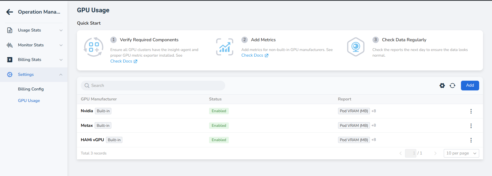
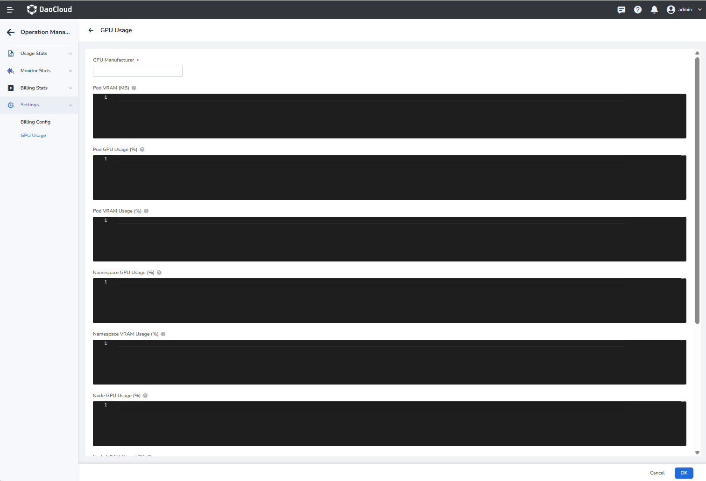
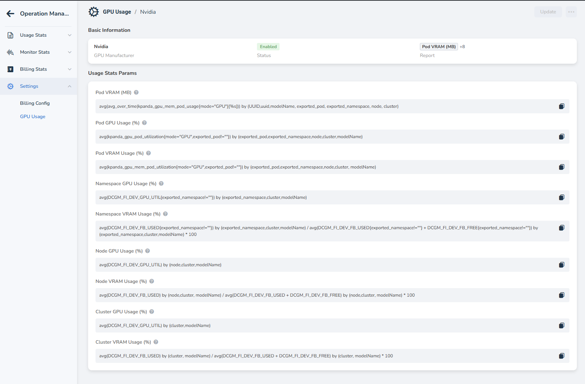

# Custom GPU Metrics Configuration

Operations Management supports custom collection rules for GPU metrics. Based on the raw metrics provided by GPU vendors, such as NVIDIA, AMD, and Huawei, and their exporters, you can use PromQL formulas to calculate and display the following performance data:

- GPU utilization
- GPU memory usage
- GPU memory utilization

Statistics can be aggregated by Pod, Namespace, Node, and Cluster.

## Procedure

### 1. Open the configuration page

1. Log in to the Operations Management console.
2. In the left navigation pane, choose **Configuration Management** -> **GPU Configuration**.

### 2. Create or edit a configuration

1. Click **Create**, or click **Edit** next to an existing configuration.
2. Enter the basic information in the form:
    - **Vendor**: Enter the GPU vendor identifier, such as `nvidia`.
    - **Status**: Enable or disable the configuration.
3. Write a PromQL formula for each item in the metric list.

!!! tip

    The code editor provides real-time syntax validation. If a formula is invalid, the editor displays the specific error below the editor.

### 3. Metric description

Refer to the following table when configuring formulas:

| Metric | Description | Example formula (NVIDIA DCGM) |
| :--- | :--- | :--- |
| **Pod GPU memory usage** | GPU memory usage of a single Pod (Bytes) | `sum(DCGM_FI_DEV_FB_USED) by (pod) * 1024 * 1024` |
| **Pod GPU utilization** | GPU computing utilization of a single Pod (%) | `avg(DCGM_FI_DEV_GPU_UTIL) by (pod)` |
| **Pod GPU memory utilization** | GPU memory utilization of a single Pod (%) | `sum(DCGM_FI_DEV_FB_USED) / sum(DCGM_FI_DEV_FB_TOTAL) * 100` |

!!! note

    Adjust the formulas according to the Prometheus metric names, such as `DCGM_FI_DEV_...`, and labels, such as `pod` and `namespace`, in your environment.

### 4. Verify and save

- After confirming that the PromQL syntax is valid, click **Confirm** to save the configuration.
- The system synchronizes the configuration in the background, and the collection rules take effect in the next cycle.

## FAQ

**Q: Why is there no data in the reports after configuration?**

- Check whether the raw metrics are available in Prometheus.
- Check whether the labels in the formula match, for example, `pod` versus `pod_name`.
- Make sure that the configuration is enabled.

**Q: Can I configure multiple vendors?**

Yes. You can create separate rules for different vendors. The system automatically matches rules according to node labels.
