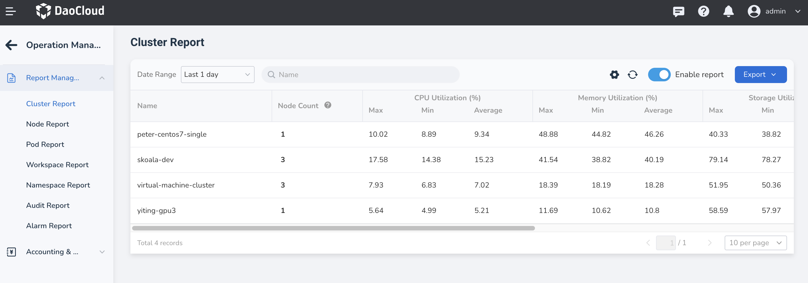

# Report Management

Report management visually displays statistical data across clusters, nodes, pods, workspaces, namespaces, audits, and alarms. This data provides a reliable foundation for platform billing and utilization optimization.

## Features

- Supports custom queries for statistical data within a year
- Allows exporting reports in CSV and Excel formats
- Supports enabling/disabling individual reports; once toggled, the platform will start/stop data collection within 20 minutes, but previously collected data will still be displayed.
- Displays maximum, minimum, and average values for CPU utilization, memory utilization, storage utilization, and GPU memory utilization

## Report Dimensions

Currently, the following reports are supported:

- **Cluster Report**: Displays the maximum, minimum, and average values of CPU utilization, memory utilization, storage utilization, and GPU memory utilization for all clusters during a specific time period, as well as the number of nodes under the cluster.
  You can quickly access the node report by clicking on the node count and view the utilization of nodes under the cluster during that period.
- **Node Report**: Displays the maximum, minimum, and average values of CPU utilization, memory utilization, storage utilization, and GPU memory utilization for all nodes during a specific time period, along with the node's IP, type, and affiliated cluster.
- **Pod Report**: Shows the maximum, minimum, and average values of CPU utilization, memory utilization, storage utilization, and GPU memory utilization for all pods during a specific time period, as well as the pod's namespace, affiliated cluster, and workspace.
- **Workspace Report**: Displays the maximum, minimum, and average values of CPU utilization, memory utilization, storage utilization, and GPU memory utilization for all workspaces during a specific time period, along with the number of namespaces and pods.
  You can quickly access the namespace report by clicking on the namespace count and view the utilization of namespaces under the workspace during that period; similarly, you can view the utilization of pods under the workspace.
- **Namespace Report**: Displays the maximum, minimum, and average values of CPU utilization, memory utilization, storage utilization, and GPU memory utilization for all namespaces during a specific time period, as well as the number of pods, affiliated clusters, and workspaces.
  You can quickly access the pod report by clicking on the pod count and view the utilization of pods within the namespace during that period.
- **Audit Report**: Divided into user actions and resource operations. The user action report mainly counts the number of operations by a single user during a period, including successful and failed attempts;
  The resource operation report mainly counts the number of operations on a type of resource by all users.
- **Alarm Report**: Displays the number of alarms for all nodes during a specific period, including the occurrences of fatal, severe, and warning alarms.

## Steps

1. Log in to DCE 5.0 as a user with the __Admin__ role. Click __Global Management__ -> __Operations Management__ at the bottom of the left sidebar.

    
   
2. After entering Operations Management, switch between different menus to view reports on clusters, nodes, pods, etc.

    
