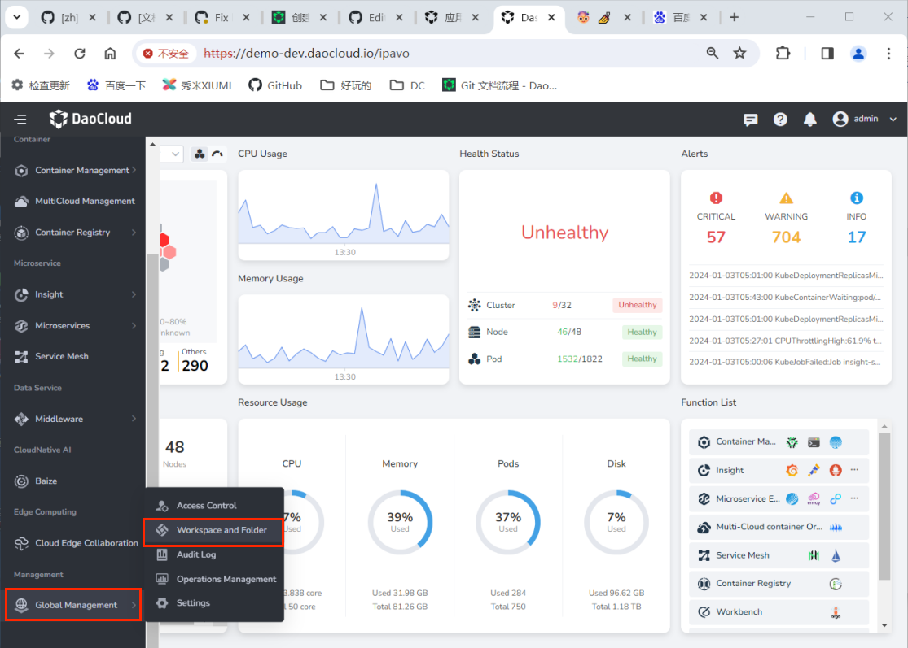

---
hide:
  - toc
---

# Create/Delete Folders

Folders have the capability to map permissions, allowing users/user groups to have their permissions in the folder mapped to its sub-folders, workspaces, and resources.

Follow the steps below to create a folder:

1. Log in to DCE 5.0 with a user account having the admin/folder admin role.
   Click __Global Management__ -> __Workspace and Folder__ at the bottom of the left navigation bar.

    

2. Click the __Create Folder__ button in the top right corner.

    

3. Fill in the folder name, parent folder, and other information, then click __OK__ to complete creating the folder.

    

!!! tip

    After successful creation, the folder name will be displayed in the left tree structure, represented by different icons for workspaces and folders.

    

!!! note

    To edit or delete a specific folder, select it and Click __⋮__ on the right side.

    - If there are resources bound to the resource group or shared resources within the folder, the folder cannot be deleted. All resources need to be unbound before deleting.

    - If there are registry resources accessed by the microservice engine module within the folder, the folder cannot be deleted. All access to the registry needs to be removed before deleting the folder.
