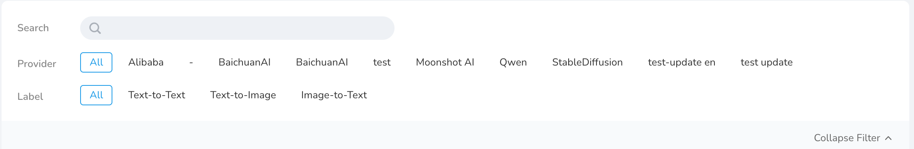
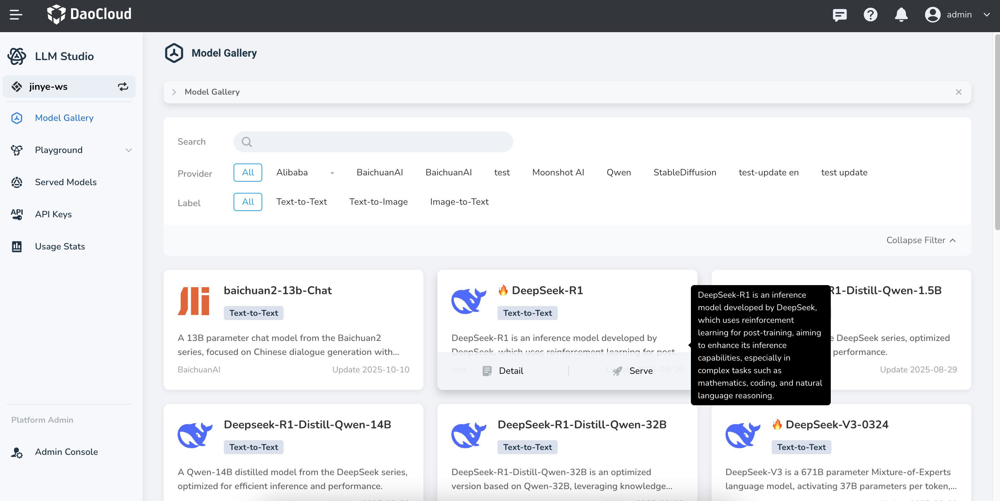
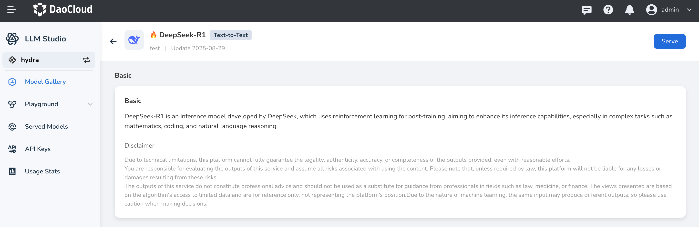
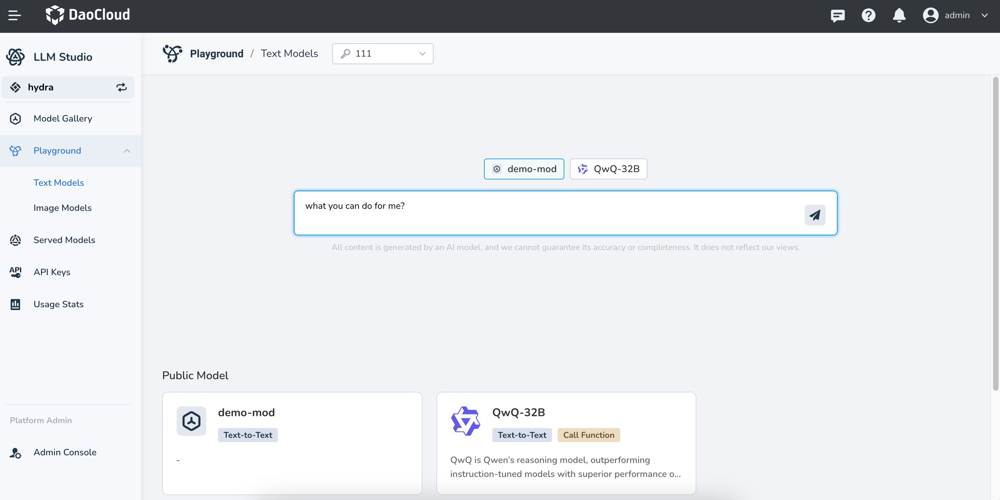

---
hide:
  - toc
---

# Model Gallery

*[Hydra]: The codename for LLM Studio

The Hydra Model Gallery offers a diverse selection of models, covering areas such as text generation, image generation, and image understanding. It integrates hundreds of models from providers like Tongyi Qianwen, Meta, and DeepSeek. Users can flexibly deploy models based on business needs to achieve efficient real-time inference.

## Filter Models

Use the Model Gallery's tags to quickly filter the model list. Multi-tag selection is supported, and filters can be cleared at any time.

- Supported filter tags include:
    - Providers: such as Tongyi Qianwen, Baichuan, GLM, Meta, etc.
    - Model types: such as text generation, image generation, image understanding, etc.
- You can also enter keywords to quickly locate a specific model.

## Model Details

When hovering over a model card's description field, a black tooltip on the right will display a full overview of the model.

Hover over a model card and click the **Details** icon to start interacting with the AI using the default corpus.

## Try Models

Click the **Try** icon on a model card to start interacting with the AI using the default corpus.

You can also try models from the **Playground** page. See [this guide](./exp.md) for more details.

## Deploy Models

You can easily deploy models from either the **Model Gallery** or the **Served Models** page. See [parameters](./deploy/deploy.md) for more information.
