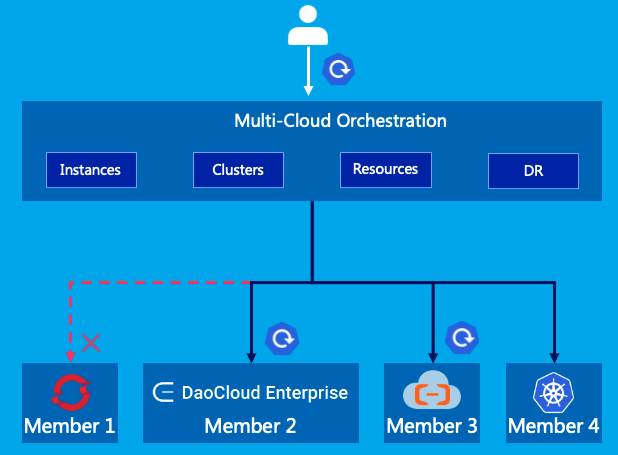

---
hide:
  - navigation
  - toc
---

# DaoCloud Enterprise 5.0

DaoCloud Enterprise 5.0 (DCE 5.0) is a high-performance and scalable cloud-native operating system
that provides a consistent and stable experience in any infrastructure or environment.
It supports heterogeneous clouds, edge clouds, and multicloud management. DCE 5.0
integrates the latest service mesh and microservice technologies, enabling tracking
of the entire lifecycle of each traffic. This helps users understand detailed metrics
of clusters, nodes, applications, and services, and visualize the health status of
applications through dynamic dashboards and topology maps.

DCE 5.0 natively supports the DevOps development and operation mode, allowing for
standardization and automation of the entire app delivery process. It also integrates
various selected databases and middleware to make operation and maintenance governance
more efficient. Each product module is independently decoupled and supports flexible
upgrades, with no impact on business operations. Additionally, it can be docked with
many cloud-native ecological products to provide a complete solution system. With nearly
a thousand industry customers having tested it in production cases, DCE 5.0 builds a
solid and reliable digital foundation, helps enterprises define digital boundaries,
and unleashes cloud-native productivity.

- :fontawesome-solid-jet-fighter-up: **Install** [Installation instructions](install/index.md)
- :octicons-container-16: **Container Management** [Cluster/node/workload infrastructure](kpanda/intro/index.md)
- :fontawesome-solid-user-group: **Global Management** [Login/Permissions/Appearance](ghippo/intro/index.md)
- :material-monitor-dashboard: **Observability** [One-stop graphical dashboard](insight/intro/index.md)
- :material-microsoft-azure-devops: **Workbench** [CI/CD pipeline](amamba/intro/index.md)
- :material-cloud-check: **Multicloud Management** [Multicloud instance/workload/policy](kairship/intro/index.md)
- :material-engine: **Microservice Engine** [Microservice governance and gateway](skoala/intro/index.md)
- :material-table-refresh: **Service Mesh** [Non-intrusive service governance](mspider/intro/index.md)
- :material-middleware: **Middleware** [ES, Kafka, MinIO, MySQL, etc.](middleware/index.md)
- :material-warehouse: **Container Registry** [Registry integration and hosting service](kangaroo/index.md)
- :material-dot-net: **Network** [Multi-CNI fusion solution](network/intro/index.md)
- :floppy_disk: **Storage** [Containerized storage](storage/index.md)

Over the past nine years, DaoCloud has made significant investments to explore
and develop a cloud-native operating system with customizable and scalable modules
that facilitate business digitalization. Each module can be used as a LEGO brick,
allowing for zero downtime while upgrading any module. DCE 5.0 is also easy to
integrate with hundreds of cloud-native ecological plugins, making it simple to
customize solutions for different use cases. This modular style allows for growth
day by day, making things better over time.

=== "Multicloud Management"

     DCE 5.0 supports unified and centralized management of multicloud and hybrid clouds,
     providing cross-cloud resource retrieval and application deployment, release, and
     operation and maintenance capabilities. This enables efficient management and control
     of multicloud applications, elastic scaling of applications based on cluster resources,
     and global load balancing.
     
     Furthermore, DCE 5.0 offers fault recovery capabilities that
     can effectively solve the problem of multicloud application disaster recovery, helping
     enterprises build multicloud and hybrid cloud digital infrastructure.

     **Modules involved**: [Global Management](ghippo/intro/index.md), [Container Management](kpanda/intro/index.md), [Multicloud Management](kairship/intro/index.md), [cloud native network](network/intro/index.md), [cloud native storage](storage/index.md), Heterogeneous architecture

    

=== "Data Middleware Service"

     The cloud-native local storage capability, specially designed for stateful applications, meets
     the high I/O storage requirements of middleware and improves the efficiency of operation and
     maintenance management. It offers middleware management capabilities for the entire lifecycle
     of multi-tenancy, deployment, observation, backup, operation, and maintenance operations, among others.

     This capability supports various middleware such as databases, distributed messages, log retrieval,
     etc., enabling self-service application, elastic expansion, high concurrent processing, and high
     stability and availability of data services.

     **Related modules**: [Global Management](ghippo/intro/index.md), [Container Management](kpanda/intro/index.md), [Cloud Native Network](network/intro/index.md), [cloud native storage](storage/index.md), [selected middleware](middleware/index.md)

    

=== "Microservice Governance"

     DCE 5.0 provides non-intrusive traffic management features, supporting non-sensing access to
     traditional microservices, cloud-native microservices, and open-source microservice frameworks.
     It achieves integrated management of existing microservice systems and old and new microservice systems of enterprises.

     This capability supports the full lifecycle management of microservices from development, deployment,
     access, observation, operation, and maintenance. It also provides high-performance cloud-native
     microservice gateways, ensuring continuous availability of microservice applications. Additionally,
     DCE 5.0 introduces independent open-source eBPF mesh acceleration technology to comprehensively improve traffic forwarding efficiency.

     **Related modules**: [Global Management](ghippo/intro/index.md), [Container Management](kpanda/intro/index.md), [Microservice Engine](skoala/intro/index.md), [Service Mesh](mspider/intro/index.md), [Observability](insight/intro/index.md), [Workbench](amamba/intro/index.md), [Cloud Native Network](network/intro/index.md), [Cloud Native Storage](storage/index.md)

    

=== "Observability"

     DCE 5.0 comprehensively collects service data based on logs, traces, metrics,
     eBPF, and other technical means. It deeply acquires request link information
     and dynamically observes and multi-dimensionally controls real-time changes
     in clusters, nodes, applications, and services.
     
     This capability enables the query of all clusters and load observation data
     through a unified control plane. Additionally, it introduces topology analysis
     technology to visualize the application health status and achieves second-level fault location.

     *[eBPF]: Extended Berkeley Packet Filter, which is a component of the Linux kernel that can run sandboxed programs in the kernel

     **Modules involved**: [Global Management](ghippo/intro/index.md), [Container Management](kpanda/intro/index.md),
     [Observability](insight/intro/index.md), [cloud-native network](network/intro/index.md), [cloud-native storage](storage/index.md)

    

=== "App Store"

     DCE 5.0 includes software products from ecological partners in ten major fields,
     such as big data and AI, middleware, etc. This enables the integration of ecological
     technology, products, operation services, and other capabilities. Additionally, it
     provides out-of-the-box ecological application software, creating a complete solution system.

     **Related modules**: [Global Management](ghippo/intro/index.md), [Container Management](kpanda/intro/index.md),
     [Cloud Native Network](network/intro/index.md), [cloud native storage](storage/index.md), app store, product ecology

=== "App Delivery"

     DCE 5.0 realizes self-service migration to the cloud through a consistent and
     scalable app delivery process. It supports flexible tenant systems, dynamically
     adapting to user organizational structure planning and real-time resource allocation.

     This capability is based on cloud-native CI/CD pipelines, integrating rich toolchains,
     and supporting efficient concurrent execution flow. Additionally, it automates the
     construction and deployment of applications, innovatively introducing GitOps and
     progressive delivery capability systems, achieving more refined management and operation of applications.

     **Modules involved**: [Global Management](ghippo/intro/index.md), [Container Management](kpanda/intro/index.md),
     [Workbench](amamba/intro/index.md), [container registry](kangaroo/index.md), [cloud native network](network/intro/index.md),
     [cloud native storage](storage/index.md)

    

=== "Heterogeneous Architecture"

     DCE 5.0 adopts a heterogeneous cloud-native technology architecture, compatible
     with domestic chips and servers. It supports a heterogeneous operating system and
     heterogeneous application ecosystem, shielding the complexity of underlying
     heterogeneous infrastructure, and liberating traditional operating systems
     from software ecological compatibility that requires long-term accumulation.

     This capability realizes the flexible scheduling of mixed heterogeneous clusters,
     ensuring the stability and reliability of the heterogeneous application operating
     environment. Furthermore, it helps speed up the heterogeneous process.

     **Related modules**: [Global Management](ghippo/intro/index.md), [Container Management](kpanda/intro/index.md),
     [Cluster Lifecycle Management](community/kubean.md), [Middleware](middleware/index.md),
     [Cloud Native Network](network/intro/index.md), [Cloud Native Storage](storage/index.md)

    

=== "Cloud to Edge Continuum"

     DCE 5.0 extends cloud-native capabilities to the edge by adopting the edge cluster
     and edge node mode. It moves the computing power of the data center down, while
     moving up the computing power of the end device. This unifies control and scheduling
     of discrete and heterogeneous computing resources, solving the problem of massive edge and end devices.

     This capability unifies the requirements of large-scale app delivery, operation
     and maintenance, management, and control on the Internet. Additionally, it realizes
     true integration of cloud and edge by bringing cloud-native capabilities to the edge.

    

=== "Cloud Native Base"

     DCE 5.0 provides cloud-native computing, networking, storage, and other capabilities,
     compatible with various cluster access. It supports the entire lifecycle of the cluster
     from deployment, version upgrade, certificate change, configuration change, and recycling,
     enabling lifecycle management. 

     This capability breaks through K8s API performance bottlenecks, allowing large-scale
     enterprise users to use multiple clusters concurrently. Additionally, for the enterprise
     environment, it provides scenario-based network solutions to maximize the reuse of
     the current enterprise network infrastructure and lower the threshold for enterprises
     to use cloud-native applications.

     **Related modules**: [Global Management](ghippo/intro/index.md), [Container Management](kpanda/intro/index.md),
     [Cluster Lifecycle Management](community/kubean.md), [cloud-native network](network/intro/index.md),
     [cloud-native storage](storage/index.md)

[Download DCE 5.0](download/index.md){ .md-button .md-button--primary }
[Install DCE 5.0](install/index.md){ .md-button .md-button--primary }
[Free Trial](dce/license0.md){ .md-button .md-button--primary }
