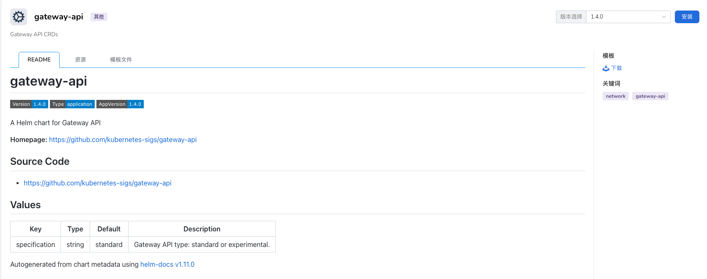
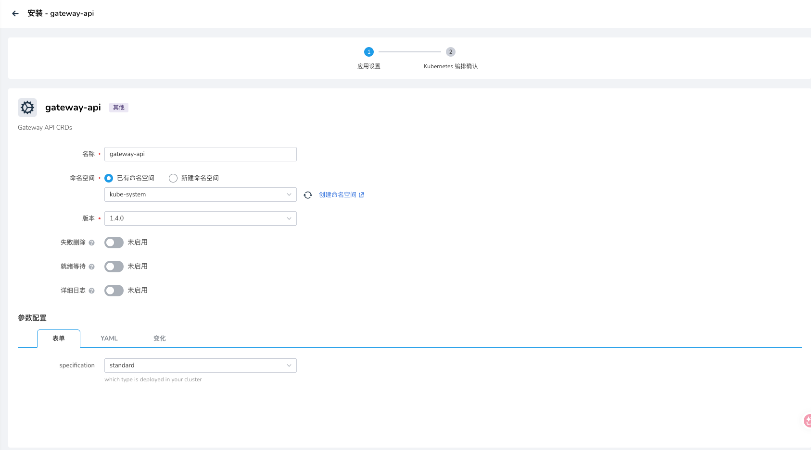

# FAQ

## Installation

### Install Gateway API

#### Via kpanda Helm Template





#### Via Online Installation

```bash
GATEWAY_API_VERSION=v1.5.0
kubectl apply --server-side -f https://github.com/kubernetes-sigs/gateway-api/releases/download/${GATEWAY_API_VERSION}/standard-install.yaml
```

### Install agent-gateway

```bash
AGW_VERSION=v1.0.0-alpha.4
helm upgrade -i --create-namespace --namespace agentgateway-system --version $AGW_VERSION agentgateway-crds oci://cr.agentgateway.dev/charts/agentgateway-crds
helm upgrade -i --namespace agentgateway-system --version $AGW_VERSION agentgateway oci://cr.agentgateway.dev/charts/agentgateway --set inferenceExtension.enabled=true
```

### Install LWS

```bash
VERSION=v0.8.0
helm install lws https://github.com/kubernetes-sigs/lws/releases/download/$VERSION/lws-chart-$VERSION.tgz --namespace lws-system --create-namespace
```

### inferencepools CRD Conflict During Installation

You can skip the inferencepools CRD installation by adding the `--skip-crds` parameter:
```bash
export INFERX_CHART_VERSION=0.1.0-xxx
helm -n public upgrade --install qwen3-06b inferx/inferx --version $INFERX_CHART_VERSION --skip-crds -f manifests/examples/inference-scheduling/values-single-vgpu.yaml
```

## Service Unavailable

### When Using HAMI & PD Disaggregation, Decode Pod Cannot Be Scheduled Due to SidecarContainers Feature Not Enabled

The error message is as follows:

```bash
Warning  FailedScheduling  2m56s                hami-scheduler  0/1 nodes are available: 1 Pod has a restartable init container and the SidecarContainers feature is disabled. preemption: 0/1 nodes are available: 1 Preemption is not helpful for scheduling..
```

The `kube-scheduler` image version in the current cluster's `nvidia-vgpu-hami-scheduler` Pod is too low and does not support the `SidecarContainers` feature. Upgrade the image version to `1.29` or higher.

### HTTPRoute Error: Group `inference.networking.k8s.io` or `inference.networking.x-k8s.io` Not Supported

The error message is as follows:

```bash
message: 'referencing unsupported backendRef: group "inference.networking.k8s.io"  kind "InferencePool"'
reason: InvalidKind
```

1. Confirm the GAIE (Gateway API Inference Extension) version supported by `gatewayClass`:

    - `inference.networking.k8s.io`
    - `inference.networking.x-k8s.io`

2. Enable the GAIE feature:

    - For istio installed via `mspider`, refer to [Enable Istio GAIE Feature in Cluster](enable-istio-gaie-with-mspider.md) for configuration
    - For istio or agent-gateway installed via other methods, refer to community documentation to enable the GAIE feature
