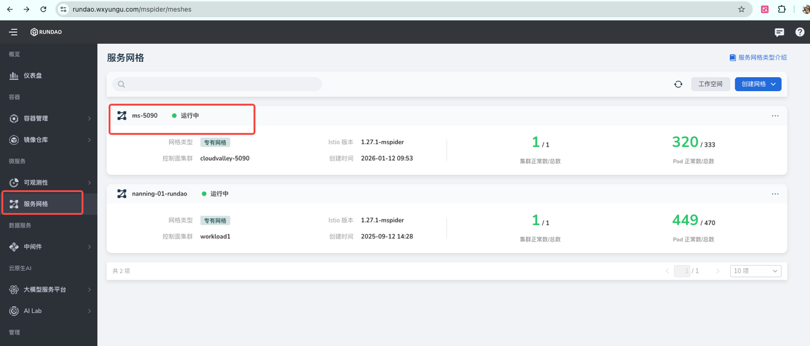
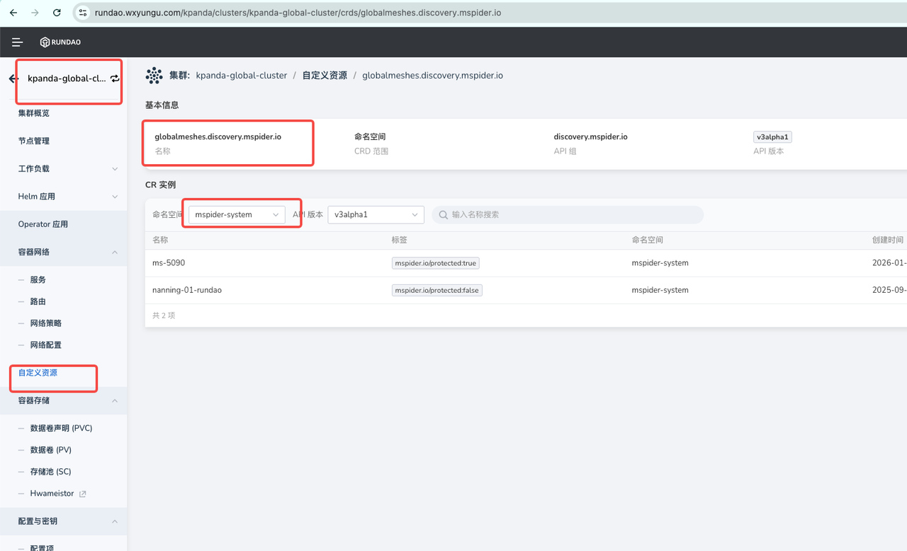
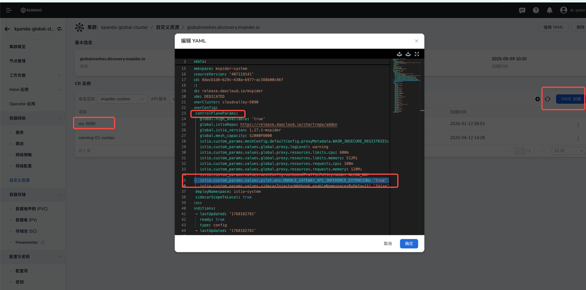

# Enable Istio GAIE Feature in Cluster

This document describes how to enable the Istio GAIE (Gateway API Inference Extension) feature in a cluster by configuring the `mspider` and `kpanda` platforms.

## Prerequisites

- Access and management permissions for the `mspider` and `kpanda` management platforms

## Steps

### 1. Get the Sub-Cluster Mesh Name

Log in to the `mspider` management platform, locate the target sub-cluster in the cluster list page, and record its corresponding mesh name.



### 2. Locate the GlobalMesh Resource

1. Log in to the `kpanda` management platform
2. Switch to the **Global cluster** view
3. Enter the custom resource type `globalmeshes.discovery.mspider.io` in the resource search box
4. Set the namespace filter to `mspider-system`
5. Find the mesh instance corresponding to the target sub-cluster in the resource list (e.g., `ms-5090`)
6. Click the **Edit YAML** button in the actions column



### 3. Configure GAIE Feature Parameters

In the YAML editing page, locate the `controlPlaneParams` configuration node and add the following configuration under it:

```yaml
istio.custom_params.values.pilot.env.ENABLE_GATEWAY_API_INFERENCE_EXTENSION: 'true'
```



### 4. Submit Configuration Changes

After confirming the configuration is correct, click the **Confirm** button to submit the changes.

## Verification

After the configuration takes effect, it is recommended to verify through the following methods:

| Verification Item | Description |
|------|-----|
| Resource Status | Check whether the `globalmeshes.discovery.mspider.io` resource status is `SUCCEEDED` |
| Configuration Applied | Confirm that the `ENABLE_GATEWAY_API_INFERENCE_EXTENSION` parameter has been correctly applied, and verify that the target cluster's `istiod` Pod contains the environment variable: `ENABLE_GATEWAY_API_INFERENCE_EXTENSION` with value `true` |
| Functional Testing | Verify that Gateway API Inference Extension related features are working properly |

!!! note

    - Configuration changes may take several minutes to take effect, please be patient
    - It is recommended to back up the original YAML configuration before making changes
    - If you encounter issues, check the relevant component logs for troubleshooting
