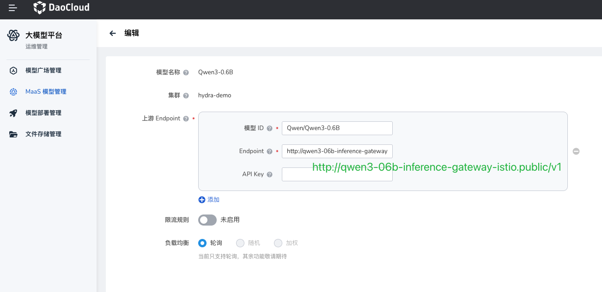
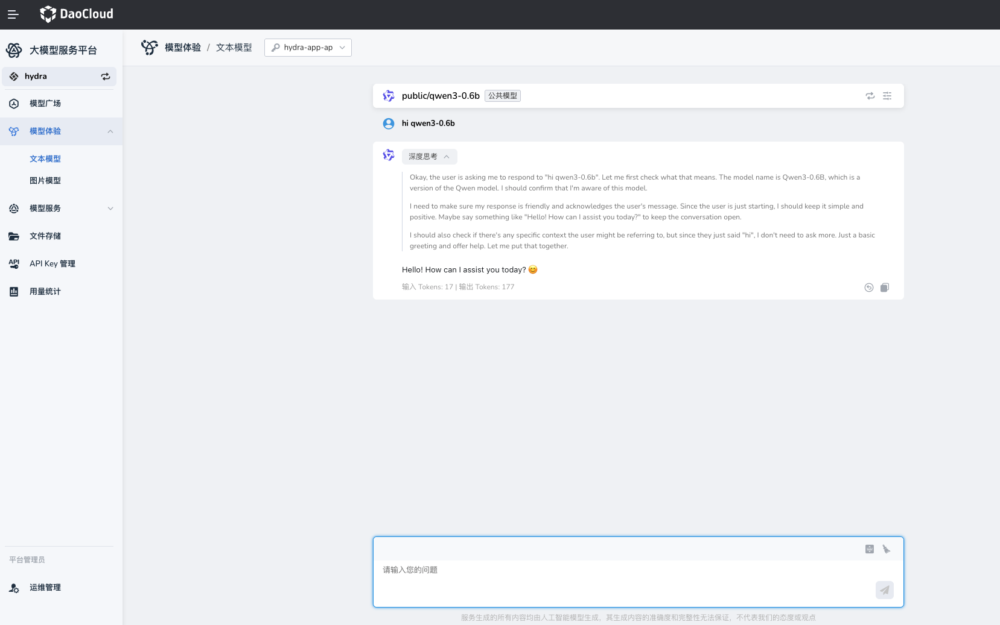

# Expose Model Service Externally (Hydra / Knoway)

After the InferX model is successfully deployed, you can expose and access it through the following two methods:

- Configure the model service in Hydra's MaaS model management page (recommended)
- Manually register the model service via the `LLMBackend` CRD in Knoway

## Prerequisites

- InferX model deployment is completed and the model is successfully deployed
- Known Helm Release name and deployment namespace (e.g., `qwen3-06b`, `public`)
- Confirmed model name (e.g., `Qwen/Qwen3-0.6B`)

## Key Parameter Mapping

| Configuration Item | Description | InferX Corresponding Parameter |
|---|---|---|
| Model ID | Model identifier used for display/calling on the business side | `llm-d-modelservice.llm-d-modelservice.modelArtifacts.name` |
| Endpoint | Model service access address, must include protocol and `/v1` path | `http://<gateway-service>.<namespace>/v1` |

## Method 1: Configure MaaS Model in Hydra

On the MaaS O&M management page, fill in the following core information for the target model:

1. **Model ID**
   It is recommended to keep it consistent with the InferX model name, e.g.: `Qwen/Qwen3-0.6B`

2. **Endpoint**
   InferX models are exposed uniformly through a Gateway. You can get the gateway address with the following command:

    ```bash
    NAMESPACE=public
    RELEASE_NAME=qwen3-06b
    kubectl -n ${NAMESPACE} get gateway/${RELEASE_NAME}-inference-gateway -o jsonpath='{.status.addresses[0].value}'
    ```

    Example output:

    ```text
    qwen3-06b-inference-gateway-istio.public.svc.cluster.local
    ```

    Assemble the Endpoint:

    ```text
    http://qwen3-06b-inference-gateway-istio.public.svc.cluster.local/v1
    ```

> The Endpoint must include the protocol (`http://`) and path prefix (`/v1`).



### Verification

Verify through the Hydra model experience interface.



## Method 2: Manually Register Model Service in Knoway

The Knoway gateway supports registering model services via the `LLMBackend` CRD:

```yaml
apiVersion: llm.knoway.dev/v1alpha1
kind: LLMBackend
metadata:
  name: custom-qwen3-06b
  namespace: default
spec:
  modelName: public/Qwen3-0.6B # Model name must be unique
  provider: vLLM
  upstream:
    baseUrl: http://qwen3-06b-inference-gateway-istio.public.svc.cluster.local/v1
    overrideParams:
      openai:
        model: Qwen/Qwen3-0.6B
```

Parameter description:

- `spec.modelName`: The exposed model name (used for business calls), must be unique
- `spec.upstream.baseUrl`: InferX Gateway address, must include `/v1`
- `spec.upstream.overrideParams.openai.model`: The actual model name passed through to the inference service

### Verification

First obtain the accessible address of the Knoway gateway (choose Istio, LoadBalancer, or NodePort based on the cluster exposure method), then send an inference request via command line to verify.

```bash
KNOWAY_ADDR=http://10.20.100.240:30633
MODEL_NAME="custom/Qwen3-0.6B"
API_KEY=<Your API Key here> # Knoway requires an authorized API Key

curl "$KNOWAY_ADDR/v1/chat/completions" \
  -H "Content-Type: application/json" \
  -H "Authorization: Bearer $API_KEY" \
  -d @- <<EOF | jq .
{
  "model": "$MODEL_NAME",
  "messages": [
    {
      "role": "user",
      "content": "Say this is a test!"
    }
  ],
  "temperature": 0.7
}
EOF
```

If the response contains `choices` and no error information (e.g., `error` field), the model service is accessible.
