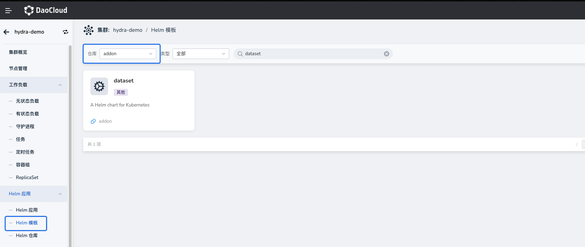
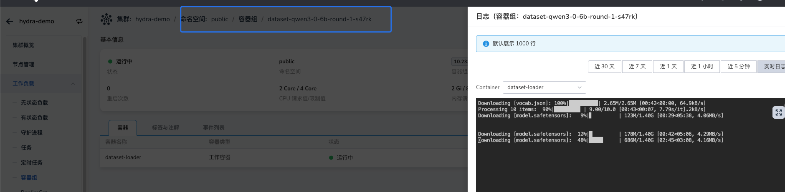

# Model Weight Download and Configuration

Before deploying a large model inference service, you need to download the model weight files to a storage location accessible by the inference service.

It is recommended to use **Dataset** to manage model weights, which can automatically complete model download, PVC creation, and cross-namespace sharing, avoiding repeated downloads and simplifying model management.

If Dataset is temporarily unavailable in your environment, you can also mount existing model weight directories into the inference service Pod through **PVC, shared storage CSI, or host directory mounting**.

## Model Weight Management Methods

InferX supports the following two model weight management methods:

| Method | Description | Recommended |
| -------- | ------------------------------------------ | -------- |
| Dataset | Automatically downloads models and manages PVCs, supports cross-namespace sharing | Recommended |
| Other Mounts | Uses existing storage (PVC / NFS / HostPath) | Optional |

## Manage Model Weights with Dataset (Recommended)

### What is Dataset

[BaizeAI/Dataset](https://github.com/BaizeAI/dataset) is a Kubernetes Volume-based data management abstraction that simplifies the creation and maintenance of PersistentVolume (PV) and PersistentVolumeClaim (PVC), supporting multiple data source types. With Dataset, you can easily obtain data from different sources and automatically create PVCs to mount into workloads.

| Type | Description |
| ------------ | ---------------------------------------- |
| GIT | Download code repositories via Git protocol |
| S3 | Read data from S3 or S3-compatible object storage |
| PVC | Reference an existing PVC to access its data |
| NFS | Mount remote directories via NFS protocol |
| HTTP | Download files via HTTP protocol |
| CONDA | Download Python packages using Conda |
| REFERENCE | Reference other Datasets to access corresponding data |
| HUGGING_FACE | Download model files from HuggingFace |
| MODEL_SCOPE | Download model files from ModelScope |

For more detailed examples, please refer to the related documentation:

- [Feishu Doc: Manage Model Files with Dataset](https://daocloud.feishu.cn/wiki/Bx1PwXtTEi36gOklOv1cQH4Znne?from=from_copylink)
- [GitHub: Cascading Deletion of Reference Datasets](https://github.com/BaizeAI/dataset/blob/main/docs/cascading-deletion-example.md)

### Dataset Installation

#### Option 1: Use DCE Hydra Built-in Dataset Capability

If **Hydra** is installed in your DCE environment, you can directly use Hydra's model weight download feature. Hydra implements model weight management based on **Dataset** without additional installation.

#### Option 2: Install Dataset Addon via DCE UI

The DCE Addon repository has a built-in Dataset Helm Chart. You can install it with one click through the UI. After installation, you can create Dataset resources as needed.



#### Option 3: Manual Helm Installation of Dataset

```bash
helm repo add baizeai https://baizeai.github.io/charts
helm repo update
helm install dataset baizeai/dataset \
  -n dataset-system \
  --create-namespace
```

### Model Weight Download

#### Create a Dataset to Download Model Weights

The following example creates a Dataset to download the Qwen3-0.6B model weights from ModelScope and allows other namespaces to reference the dataset.

```yaml
apiVersion: dataset.baizeai.io/v1alpha1
kind: Dataset
metadata:
  name: qwen3-0-6b
  namespace: public
spec:
  share: true                     # Allow other namespaces to reference via REFERENCE
  source:
    options:
      repoType: MODEL
    type: MODEL_SCOPE             # Data source type is ModelScope
    uri: modelscope://Qwen/Qwen3-0.6B
    # If using HuggingFace, change type and uri to:
    # type: HUGGING_FACE
    # uri: huggingface://Qwen/Qwen3-0.6B
  # To customize storage class or capacity, configure volumeClaimTemplate:
  # volumeClaimTemplate:
  #   metadata: {}
  #   spec:
  #     resources:
  #       requests:
  #         storage: 100Gi
  #     storageClassName: juicefs-no-share-sc
```

After creating the Dataset, the system automatically starts a Job to download the model weights to the corresponding PVC. You can check the Job logs to monitor download progress.



#### Share Existing Dataset Across Namespaces

In the Hydra model plaza, model weights are typically stored in the `public` namespace. To avoid repeated downloads, you can create a reference-type Dataset in the target namespace pointing to the existing weight data.

> **Note**: The referenced Dataset must have `spec.share: true` set, and (if `shareToNamespaceSelector` is configured) the target namespace must be included.

```yaml
apiVersion: dataset.baizeai.io/v1alpha1
kind: Dataset
metadata:
  name: inferx-modelcache-qwen3-0-6b
  namespace: default
spec:
  source:
    type: REFERENCE
    uri: dataset://public/qwen3-0-6b   # Format is dataset://[namespace]/[Dataset name]
```

### Dataset and PVC Correspondence

By default, the PVC name created by Dataset is the same as the Dataset name, unless a PVC with the same name already exists in the target namespace. You can confirm the associated Dataset through the PVC's labels and owner information:

```yaml
kind: PersistentVolumeClaim
apiVersion: v1
metadata:
  name: inferx-modelcache-qwen3-0-6b
  namespace: default
  labels:
    baize.io/dataset-name: inferx-modelcache-qwen3-0-6b   # Associated Dataset name
  ownerReferences:
    - apiVersion: dataset.baizeai.io/v1alpha1
      kind: Dataset
      name: inferx-modelcache-qwen3-0-6b                 # Owning Dataset
spec:
  accessModes:
    - ReadWriteMany
  resources:
    requests:
      storage: 100Ti
  volumeName: dataset-default-inferx-modelcache-qwen3-0-6b-34403596-d94
  storageClassName: nfs-hdd-csi
  volumeMode: Filesystem
```

### Using Dataset Models in InferX

When deploying an InferX inference service, you can specify the PVC mount path for model weights via Helm Values. Here is an example snippet:

```yaml
llm-d-modelservice:
  enabled: true
  llm-d-modelservice:
    modelArtifacts:
      name: "Qwen/Qwen3-0.6B"               # Model name, used to identify served-model-name
      uri: "pvc://inferx-modelcache-qwen3-0-6b/"   # Note: must use pvc://<PVC name>/<model subpath in PVC> format
      mountPath: /model-cache               # Mount path of model weights in the container, typically keep default
      labels:
        app: qwen3-0.6b                       # Label for model service Pods, must match inferencepool's matchLabels
        llm-d.ai/inference-serving: "true"
```

**URI Format Description**: `pvc://<PVC name>/<model subpath in PVC>`.

- If the model files are in a subdirectory of the PVC, e.g., `/model-cache/Qwen/Qwen3-0.6B`, then `uri` should be: `pvc://inferx-modelcache-qwen3-0-6b/Qwen/Qwen3-0.6B`
- If the model files are directly in the PVC root directory, you must still keep the trailing `/`, e.g.: `pvc://inferx-modelcache-qwen3-0-6b/`

## Other Mount Methods

If Dataset is not installed in the cluster, or if model weights already exist in external storage, you can also use models directly through mounting.

Common methods include the following two.

### Method 1: Mount Shared Storage via PVC

First prepare the model files in shared storage (e.g., NFS / JuiceFS), then create a PVC and reference it in InferX.

Example configuration:

```yaml
llm-d-modelservice:
  enabled: true
  llm-d-modelservice:
    modelArtifacts:
      name: "Qwen/Qwen3-0.6B"
      uri: "pvc://custom-share-models/qwen06b"   # pvc://[shared directory PVC name][model path]
      mountPath: /model-cache
      labels:
        app: qwen3-0.6b
        llm-d.ai/inference-serving: "true"
```

### Method 2: Mount Model Directory via Custom Container

In certain scenarios, model weights may be stored in directories not managed by CSI, such as:

- Host local directory
- Special object storage mount point
- Custom file system

In this case, you can mount the host directory directly into the Pod via custom inference container configuration, and specify the model path through a custom startup command.

Example configuration:

```yaml
llm-d-modelservice:
  enabled: true
  llm-d-modelservice:
    decode:
      create: true
      parallelism:
        tensor: 1
        data: 1
      replicas: 1
      containers:
        - name: "vllm"
          image:
            registry: docker.m.daocloud.io
            repository: vllm/vllm-openai
            tag: v0.18.0
          # ---------------------------------------------
          # Use custom command line to load weights directly from the host model directory mounted at /custom-path
          modelCommand: custom
          command:
            - /bin/bash
            - '-c'
          args:
            - |
              vllm serve /custom-path/Qwen3-0.6B \
              --port 8000 \
              --served-model-name Qwen/Qwen3-0.6B
          # ---------------------------------------------
          ports:
            - containerPort: 8000
              name: metrics
              protocol: TCP
          resources:
            limits:
              nvidia.com/gpumem: 10k
              nvidia.com/vgpu: '1'
            requests:
              nvidia.com/gpumem: 10k
              nvidia.com/vgpu: '1'
          volumeMounts:
            - name: metrics-volume
              mountPath: /.config
            - name: shm
              mountPath: /dev/shm
            - name: torch-compile-cache
              mountPath: /.cache
            - name: host-models                        # Mount the host model directory into the container
              mountPath: /custom-path                  # Keep consistent with /custom-path used in the custom command above
          startupProbe:
            httpGet:
              path: /health
              port: 8000
            initialDelaySeconds: 15
            periodSeconds: 30
            timeoutSeconds: 5
            failureThreshold: 60
          livenessProbe:
            httpGet:
              path: /health
              port: 8000
            periodSeconds: 10
            timeoutSeconds: 5
            failureThreshold: 3
      volumes:
        - name: metrics-volume
          emptyDir: { }
        - name: shm
          emptyDir:
            medium: Memory
            sizeLimit: "16Gi"
        - name: torch-compile-cache
          emptyDir: { }
        - name: host-models
          hostPath:
            path: /data/models/qwen3-0.6b             # Example path of model weight directory on the host (adjust the actual path as needed)
            type: Directory
```
