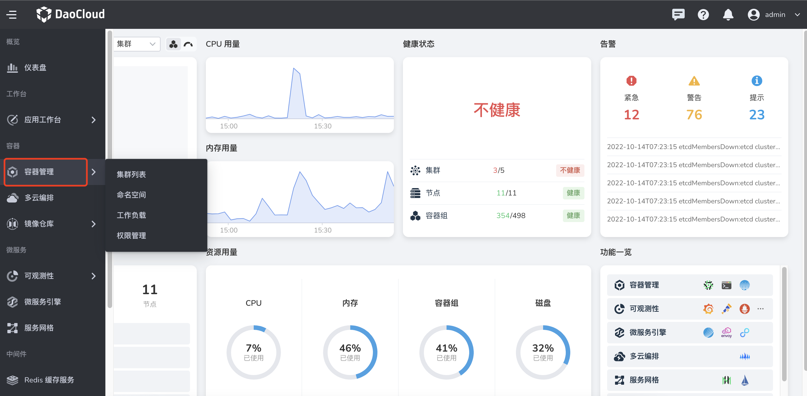
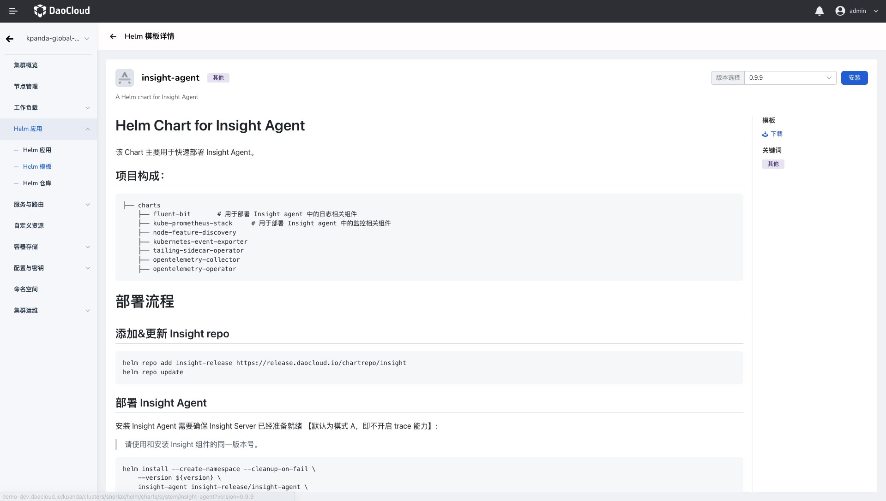

# Install insight-agent to collect data

Please confirm that your cluster has successfully connected to the container management platform, and then perform the following steps to install insight-agent to collect data.

1. Enter `Container Management` from the left navigation bar, and enter `Cluster List`.

    

1. Click on the name of the cluster where you want to install insight-agent.

    

1. In the left navigation bar, select `Helm Application` -> `Helm Template`, find `insight-agent`, and click the tile card.

    

1. Select the appropriate version and click `Install`.

    

1. Fill in the name, select the namespace and version, and fill in the addresses of logging, metric, audit, and trace reporting data in the yaml file.

All field information has been filled in by default, you can use it directly and click `OK`. If you need to modify the data reporting address, please refer to [Get Data Reporting Address](gethosturl.md).

    

    The meanings of several option switches are:

    - Failed to delete: After enabling `Failed to delete`, the installation wait will be enabled synchronously by default. If the installation fails, delete related resources.
    - Ready Wait: When `Ready Wait` is enabled, the application will be marked as installed successfully after all associated resources created are in the ready state by default.
    - Detailed log: When enabled, the installation process log will be output in detail.

1. The system will automatically return to `Helm application`, the status is `not ready` at the beginning, and the status changes to `deployed` after a period of time, indicating that the insight-agent is installed successfully.

    

    !!! note

        - Click `⋮` on the far right, and you can perform more operations such as `Update`, `View YAML` and `Delete` in the pop-up menu.
        - For a practical installation demo, watch [Video demo of installing insight-agent](../../../videos/insight.md#_6)