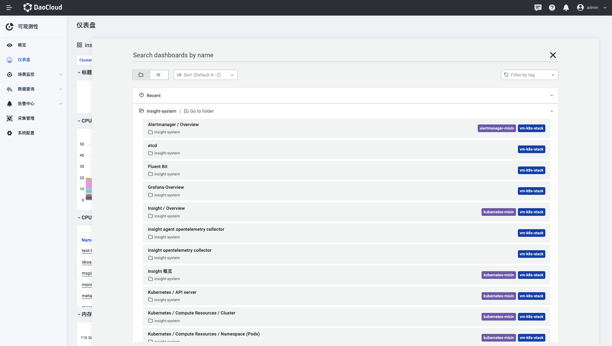

---
hide:
  - toc
---

# dash board

Observability Insight provides open source selected dashboards through native Grafana to monitor clusters, nodes, namespaces and other dimensions. The data source used by Grafana supports viewing data from multiple clusters.

1. Select Dashboard in the left navigation bar.

    

2. Taking `Insight Overview` as an example, perform the following steps to set relevant parameters and view cluster indicators.

    - In the upper left corner of the page, select a cluster to view resource usage in the selected cluster.

    

3. Click the title `Insight Overview` area to switch the dashboard.

    

!!! note
    
    To access native Grafana, please refer to: [Login to Grafana as administrator](../../06UserGuide/02dashboard/logingrafana.md)
    
    For importing a custom dashboard, please refer to: [Import a custom dashboard](../../09FAQs/importdashboard.md)