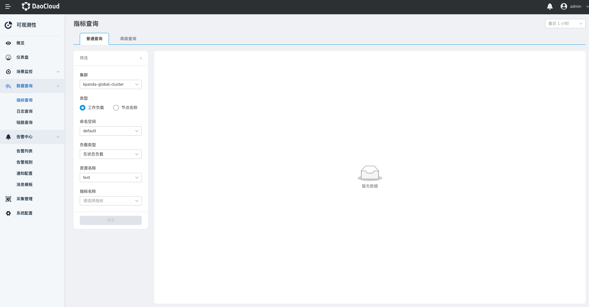
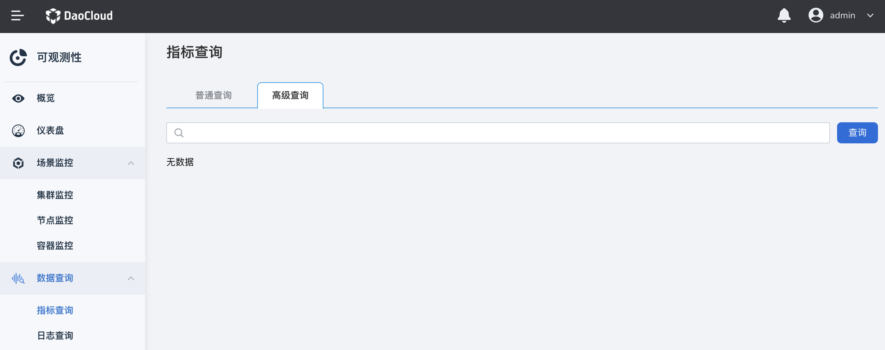

# index query

Index query supports querying the index data of each container resource, and you can view the trend changes of the monitoring index. At the same time, advanced query supports native PromQL statements for index query.

## prerequisites

- The cluster has [insight-agent installed](../../06UserGuide/01quickstart/installagent.md) and the application is in `running` state.

## Common query

1. In the left navigation bar, click `Data Query` -> `Indicator Query`.

    

2. After selecting query conditions such as cluster, type, node, and indicator name, click `Search`, and the corresponding indicator chart and data details will be displayed on the right side of the screen.

    

!!! tip

    Support custom time range. You can manually click the `Refresh` icon or select a default time interval to refresh.

## Advanced Search

1. In the left navigation bar, click `Data Query` -> `Indicator Query`, click the `Advanced Query` tab to switch to the advanced query page.

    

2. Enter a PromQL statement (see [PromQL Syntax](https://prometheus.io/docs/prometheus/latest/querying/basics/), click `Query`, and the query indicator chart and data details will be displayed.

    